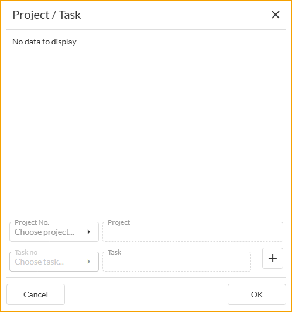

## Mitarbeiter

Wie bei der mobilen App kann jeder Benutzer auf das **AppsForDynamics365.com** Webportal zugreifen, um Ausgaben und Kilometerstände zu erstellen.

#### Anmeldung im Portal

Für die Anmeldung im AppsForDynamics365-Portal sind Anmeldeinformationen erforderlich, die per E-Mail bereitgestellt werden, wenn das Konto eingerichtet wird. Die Anmeldung kann auf zwei verschiedene Arten erfolgen:

**Benutzername und Passwort** oder **Anmelden mit Microsoft.**

Alternativ wenden Sie sich an den Business Central-Administrator oder die IT-Abteilung, wenn eine Anmeldung nicht möglich ist.

#### Hauptseite

Die Hauptseite ist die nächste Seite im Portal. Die Seite ist in Ausgaben, Kilometerstände, Spesenabrechnung und Tagegeld unterteilt.

Die **Ausgaben**-Liste zeigt Ihre Ausgaben an, die noch nicht zur Genehmigung eingereicht wurden. Jedes Element wird mit diesem Symbol angezeigt  

Die **Kilometerstände**-Liste zeigt Ihre Kilometerstände an, die noch nicht zur Genehmigung eingereicht wurden. Jedes Element wird mit diesem Autosymbol angezeigt  

Die **Kreditkartentransaktionen** sind Kreditkartentransaktionen, die mit Ihrer Mitarbeiterkreditkarte getätigt wurden. Jedes Element wird mit diesem Kartensymbol angezeigt  

 

#### Einreichen von Ausgaben

Obwohl die Einreichung von Ausgaben über die App empfohlen wird, kann dies auch über das Webportal erfolgen, fast auf die gleiche Weise.

Gehen Sie zu: **Reise & Ausgaben --> Neue Ausgabe**

Beginnen Sie den Prozess der Einreichung einer Ausgabe, indem Sie die folgende Ansicht ausfüllen:

**Datei oder Foto**: Fügen Sie eine Datei oder ein Foto der Quittung oder einer relevanten Datei hinzu, indem Sie auf den linken Bereich klicken oder sie einfach in den Bereich ziehen. Unterstützte Dateitypen sind PDF und die meisten gängigen Bildtypen.

**Datum**: Wählen Sie das Datum aus. Das heutige Datum ist standardmäßig eingestellt.

**Währung**: Ändern Sie die Währung bei Bedarf.

**Betrag:** Geben Sie den Betrag ein.

**Land**: Ändern Sie bei Bedarf das Land für die Ausgabe. Dies ist standardmäßig auf Ihr Landeinstellung in Business Central eingestellt.

**Beschreibung**: Geben Sie eine Beschreibung ein. Dies wird der Titel für die Ausgabe sein.

**Bezahlt von**: Wählen Sie im Feld zwischen Mitarbeiter und Firmenkarte.

**Kategorie**: Wählen Sie eine Kategorie für die Ausgabe aus den von Ihrem Unternehmen bereitgestellten Kategorien.

**Speichern** oder **Einreichen:** Speichern Sie die Ausgabe und senden Sie sie später oder senden Sie sie sofort.

Nachfolgend sind optionale Felder beim Erstellen einer Ausgabe aufgeführt, abhängig von den Richtlinien Ihres Unternehmens.

**Mitarbeiter**: Fügen Sie Mitarbeiter hinzu oder entfernen Sie sie. Ihr Name wird standardmäßig hinzugefügt.

**Teilnehmer**: Fügen Sie Teilnehmer hinzu oder entfernen Sie sie. Beispiele sind Gäste oder Kunden.

**Projekt/Aufgabe**: Geben Sie einen Job und eine Aufgabe ein. Dies wird hauptsächlich für Beratungsfirmen verwendet.

**Zusätzliche Informationen**: Geben Sie alle zusätzlichen Informationen ein, die relevant sein könnten.

 

### Kreditkartentransaktionen

Kreditkartentransaktionen sind eine beliebte Möglichkeit, mehrere Dinge zu bezahlen, und dies erstreckt sich auch auf das Bezahlen im Namen des Unternehmens. ExFlow Travel & Expense vereinfacht die Meldung dieser Transaktionen, insbesondere wenn Kreditkartenvereinbarungen eingerichtet wurden, da eine automatische Zuordnung zu passenden Spesenabrechnungen möglich wird.

Eine Kreditkartentransaktion kann vom Dashboard aus geöffnet, Details ausgefüllt und dann als Ausgabe gesendet werden. Wenn bereits eine Ausgabe für die Kreditkartentransaktion erstellt wurde, kann sie mit der Kreditkartentransaktion zusammengeführt werden.

#### Einreichen von Kreditkartentransaktionen vor dem Import der Transaktion

Gehen Sie zu: **Reise & Ausgaben --> Neue Ausgabe**

Der Prozess der Einreichung einer Ausgabe beginnt mit dem Ausfüllen der folgenden Ansicht.

Wichtig! Dies ist der Prozess zur Meldung einer Ausgabe, bevor die Kreditkartentransaktion in ExFlow Travel & Expense importiert wird.

**Datei oder Foto**: Fügen Sie eine Datei oder ein Foto der Quittung oder einer relevanten Datei hinzu, indem Sie auf den linken Bereich klicken oder sie einfach in den Bereich ziehen. Unterstützte Dateitypen sind PDF und die meisten gängigen Bildtypen.

**Datum**: Wählen Sie das Datum aus. Das heutige Datum ist standardmäßig eingestellt.

**Währung**: Ändern Sie die Währung bei Bedarf.

**Betrag:** Geben Sie den Betrag ein.

**Land**: Ändern Sie bei Bedarf das Land für die Ausgabe. Dies ist standardmäßig auf Ihr Landeinstellung in Business Central eingestellt.

**Beschreibung**: Geben Sie eine Beschreibung ein. Dies wird der Titel für die Ausgabe sein.

**Bezahlt von**: Wählen Sie im Feld zwischen Mitarbeiter und Firmenkarte.

**Kategorie**: Wählen Sie eine Kategorie für die Ausgabe aus den von Ihrem Unternehmen bereitgestellten Kategorien.

**Speichern** oder **Einreichen:** Speichern Sie die Ausgabe und senden Sie sie später oder senden Sie sie sofort.

Nachfolgend sind optionale Felder beim Erstellen einer Ausgabe aufgeführt, abhängig von den Richtlinien Ihres Unternehmens.

**Mitarbeiter**: Fügen Sie Mitarbeiter hinzu oder entfernen Sie sie. Ihr Name wird standardmäßig hinzugefügt.

**Teilnehmer**: Fügen Sie Teilnehmer hinzu oder entfernen Sie sie. Beispiele sind Gäste oder Kunden.

**Projekt/Aufgabe**: Geben Sie einen Job und eine Aufgabe ein. Dies wird hauptsächlich für Beratungsfirmen verwendet.

**Zusätzliche Informationen**: Geben Sie alle zusätzlichen Informationen ein, die relevant sein könnten.

**Transaktion erwarten**: Wählen Sie diese Option, wenn die Ausgabe einer Kreditkartentransaktion zugeordnet werden soll.

 

#### Einreichen von Kreditkartentransaktionen bei importierter Transaktion

Gehen Sie zu: **Reise & Ausgaben --> Wählen Sie die Kreditkartentransaktion**

Beginnen Sie den Prozess der Einreichung einer Ausgabe, indem Sie die folgende Ansicht ausfüllen.

**Datei oder Foto**: Fügen Sie eine Datei oder ein Foto der Quittung oder einer relevanten Datei hinzu, indem Sie auf den linken Bereich klicken oder sie einfach in den Bereich ziehen. Unterstützte Dateitypen sind PDF und die meisten gängigen Bildtypen.

**Beschreibung**: Geben Sie eine Beschreibung ein. Dies wird der Titel für die Ausgabe sein.

**Private Nutzung**: Wenn die Firmenkarte privat genutzt wurde, markieren Sie die Transaktion als private Nutzung.

**Kategorie**: Wählen Sie eine Kategorie für die Ausgabe aus den von Ihrem Unternehmen bereitgestellten Kategorien.

**Speichern** oder **Einreichen:** Speichern Sie die Ausgabe und senden Sie sie später oder senden Sie sie sofort.

Nachfolgend sind optionale Felder beim Erstellen einer Ausgabe aufgeführt, abhängig von den Richtlinien Ihres Unternehmens.

**Mitarbeiter**: Fügen Sie Mitarbeiter hinzu oder entfernen Sie sie. Ihr Name wird standardmäßig hinzugefügt.

**Teilnehmer**: Fügen Sie Teilnehmer hinzu oder entfernen Sie sie. Beispiele sind Gäste oder Kunden.

**Projekt/Aufgabe**: Geben Sie einen Job und eine Aufgabe ein. Dies wird hauptsächlich für Beratungsfirmen verwendet.

**Zusätzliche Informationen**: Geben Sie alle zusätzlichen Informationen ein, die relevant sein könnten.

**Transaktion erwarten**: Wählen Sie diese Option, wenn die Ausgabe einer Kreditkartentransaktion zugeordnet werden soll.

#### Zuordnungsproblem zwischen Spesenabrechnung und Kreditkartentransaktion

Wenn die Spesenabrechnung und die Kreditkartentransaktion nicht automatisch zugeordnet werden können, muss der Benutzer sie manuell zuordnen.

Gehen Sie zu: **Reise & Ausgaben --> Wählen Sie die Kreditkartentransaktion**

In der linken Ecke finden Sie ein Dropdown-Menü namens **Zuordnen**.

Finden Sie die Spesenabrechnung, die mit der Kreditkartentransaktion verbunden ist.

Wählen Sie **Weiter** und **Einreichen**.

### Einreichen mit einer Spesenabrechnung

Spesenabrechnungen ermöglichen es Ihnen, Ausgaben, Kilometerstände und Tagegelder zu organisieren, um eine Übersicht über die Ausgaben zu erhalten.

Gehen Sie zu: **Reise & Ausgaben --> Spesenabrechnung**

**Beschreibung:** Geben Sie eine Beschreibung für die Spesenabrechnung ein.

**Zusätzliche Informationen**: Geben Sie alle zusätzlichen Informationen ein.

**Projekt/Aufgabe**: Die Spesenabrechnung kann einem bestimmten Projekt zugeordnet werden, dies fügt das Projekt und die Aufgabe zu allen Transaktionen hinzu, die der Spesenabrechnung hinzugefügt werden.

Nach dem Erstellen einer Spesenabrechnung wird ein neues Feld mit der Bezeichnung Spesenabrechnung angezeigt, wenn Sie eine Ausgabe, einen Kilometerstand oder ein Tagegeld einreichen. Unten ist ein Beispiel von der Kilometerstandseite.

