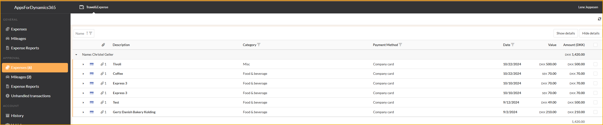
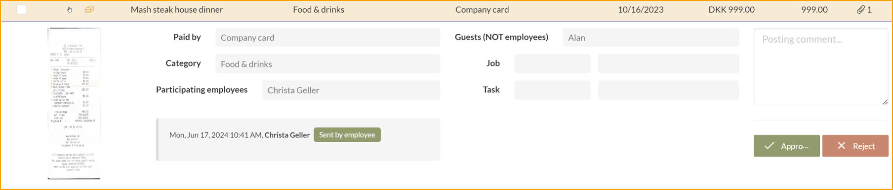
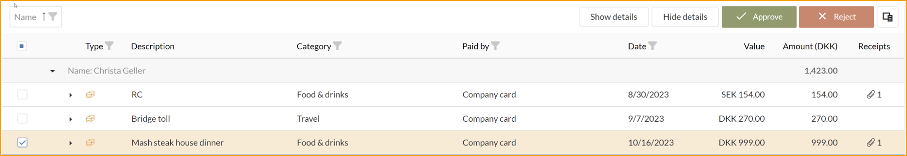
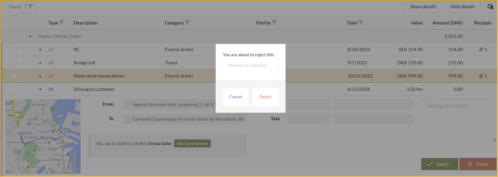
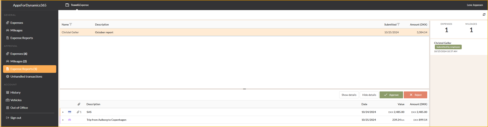
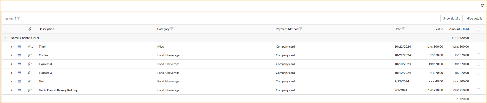
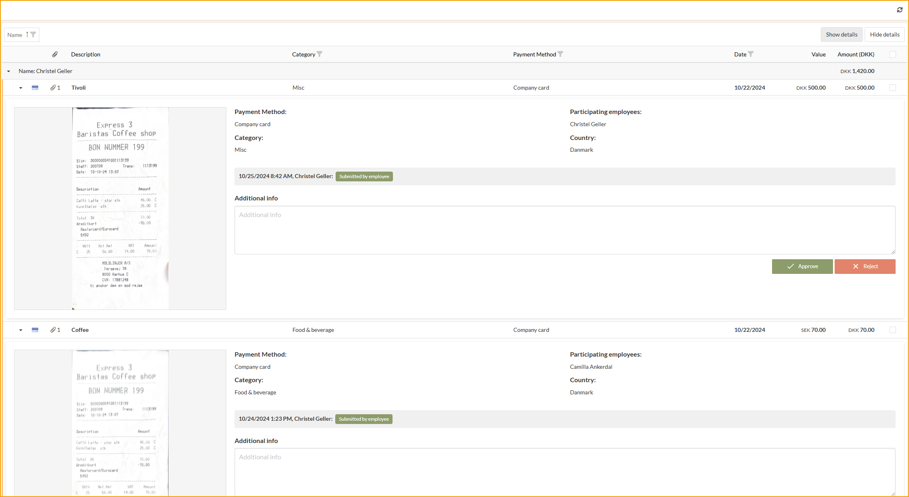

## Genehmiger

Als Genehmiger besteht Ihre Aufgabe darin, die Ausgaben- und Kilometerabrechnungen der zugewiesenen Benutzer zu überprüfen und zu entscheiden. Dies umfasst das Empfangen von Einreichungen, deren Bewertung und entweder die Genehmigung oder Ablehnung zur weiteren Bearbeitung durch die Buchhaltungsabteilung.

Diese Aufgabe wird im Webportal durchgeführt, das eine praktische Übersicht über alle Ausgaben, Kilometer, Spesenabrechnungen und Tagegelder bietet, die auf Genehmigung warten.

### Genehmigung

Gehen Sie zu: **Reise & Ausgaben --> Genehmigung**

Die **Genehmigung**-Liste bietet dem Genehmiger zwei einfache Möglichkeiten, Ausgaben und Kilometerabrechnungen zu genehmigen oder abzulehnen.

1. Öffnen Sie einen Eintrag, überprüfen Sie die Anhänge und Details. Wählen Sie dann **Genehmigen** oder **Ablehnen**.

2. Verwenden Sie die Kontrollkästchen und wählen Sie einen oder mehrere Einträge aus. Verwenden Sie dann die **Genehmigen**- oder **Ablehnen**-Schaltflächen am Ende der Liste, um alle Einträge auf einmal zu bearbeiten.

### Ablehnung

Wenn der Genehmiger eine Ausgabe oder Kilometerabrechnung ablehnt, muss er einen Grund für die Ablehnung angeben, damit die Person, die die Ablehnung erhält, die betreffenden Probleme ändern kann.

#### Genehmigung und Ablehnung eines Spesenberichts

Sobald der Spesenbericht eingereicht wurde, erhält der Genehmiger eine Zusammenfassung und kann ihn entweder vollständig genehmigen oder alle / Teile davon ablehnen.

#### Details ausblenden oder anzeigen

Der Genehmiger hat die Möglichkeit, Details in der Übersicht auszublenden oder anzuzeigen, was während des Genehmigungsprozesses hilfreich sein kann.

**Details ausblenden** wird so angezeigt:

**Details anzeigen** wird so angezeigt:

