## Für die Finanzabteilung

Die Buchhaltung ist der letzte Schritt bei der Bearbeitung von Ausgaben oder Kilometergeld und kann mit nur wenigen Klicks in ExFlow Travel & Expense Business Central effizient verwaltet werden. Bitte beachten Sie, dass Business Central nicht für die Einreichung von Ausgaben konzipiert ist. Verwenden Sie hierfür bitte die mobile App oder das Webportal.

 

### Übersicht in Business Central

Die Rollen **Travel & Expense, Business Manager** und **Accountant** enthalten die folgenden Kartenhinweise im Rollencenter. Bitte beachten Sie! BC zeigt nur die Kartenhinweise an, die mehr als 0 Ausgaben haben.

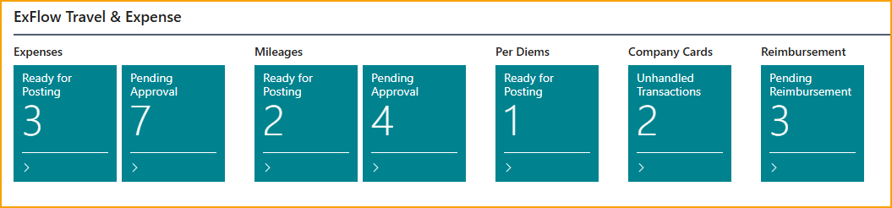

 

### Ausgaben

Nachdem eine Ausgabe eingereicht und genehmigt wurde, kann sie vom Buchhalter in Business Central bearbeitet werden. Die Bearbeitung einer Ausgabe kann verschiedene Elemente umfassen, wie zum Beispiel:

-   Buchen der Ausgabe.

-   Eine Kreditkartentransaktion als private Nutzung kennzeichnen.

-   Die Ausgabe zwischen mehreren Mitarbeitern aufteilen.

-   Ausgaben entweder an den Genehmiger zurücksenden oder vollständig ablehnen.

#### Eine Ausgabe buchen

Das Buchen einer genehmigten Ausgabe kann in wenigen Schritten erfolgen.

Gehen Sie zu: **Bereit zum Buchen (TEM)**

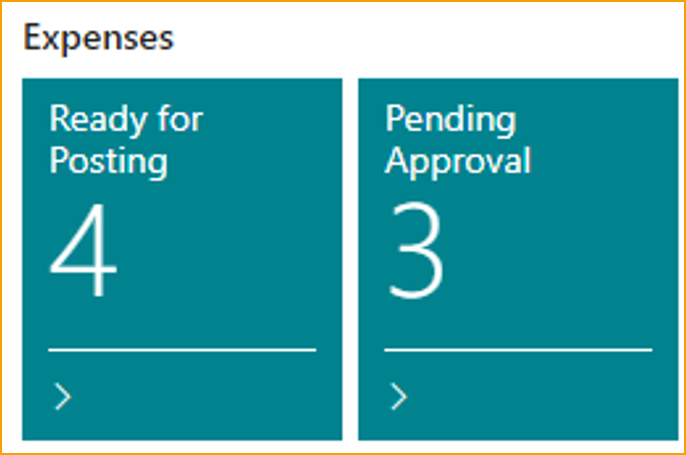

Buchen Sie eine Ausgabe, indem Sie **F9** drücken oder **Buchen** auswählen.

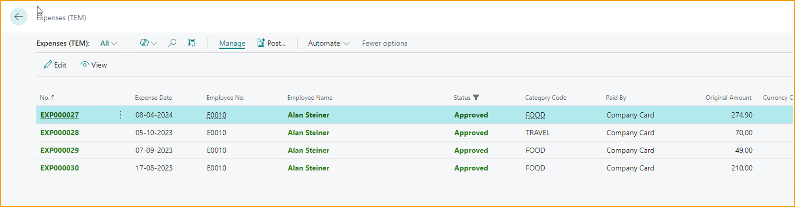

Der Benutzer kann nur Ausgaben mit dem Status **Genehmigt** (grüne Farbe) buchen.

 

### Die Ausgabe bearbeiten

Wenn der Buchhalter die Ausgabe vor dem Buchen überprüfen oder bearbeiten möchte.

Gehen Sie zu: **Bearbeiten --> auf das "Pin" klicken**

Die Felder, die in dieser Ansicht bearbeitet werden können, sind:

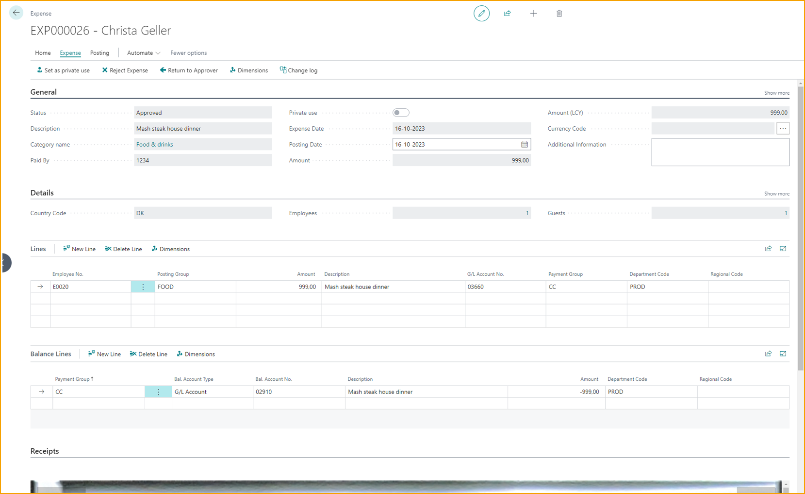

**Buchungsdatum**: Der Tag, an dem der Artikel gebucht werden soll, nützlich für Unternehmen, die ihre Ausgaben an bestimmten Tagen des Monats buchen möchten.

**Zusätzliche Informationen**: Der Benutzer kann alle relevanten Informationen oder Kontexte hinzufügen.

**Zeilen**: Der Benutzer kann die Einzelheiten der betreffenden Ausgabe ändern, wie z.B. Buchungsgruppen und welche Mitarbeiter beteiligt waren. Der Buchhalter kann die Ausgaben auch zwischen den Mitarbeitern aufteilen.

**Saldozeilen**: Dies sind die Zeilen, die an die Mitarbeiter ausgezahlt werden sollen.

**Dimensionen**: Über **Dokument** in der Aktionsleiste zugänglich, ermöglicht die Dimensionsansicht dem Buchhalter, Dimensionen zu ändern. Diese sind Business Central Standard.

 

### Eine Ausgabe aufteilen

Einige bereits genehmigte Ausgaben müssen gelegentlich zwischen den Mitarbeitern aufgeteilt werden. Dies kann manuell aus der Ausgabenbearbeitungsansicht erfolgen.

Gehen Sie zu: **Bearbeiten --> auf das "Pin" klicken --> Details -->**

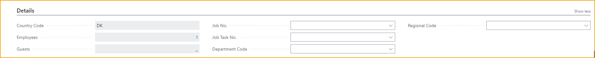

1.  **Mitarbeiter:** Klicken Sie auf die Nummer

2.  Klicken Sie auf **Neu**

3.  Fügen Sie einen Mitarbeiter hinzu

4.  Schließen Sie das Fenster

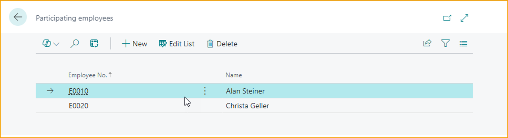

5.  Klicken Sie auf **Ausgabe aufteilen**

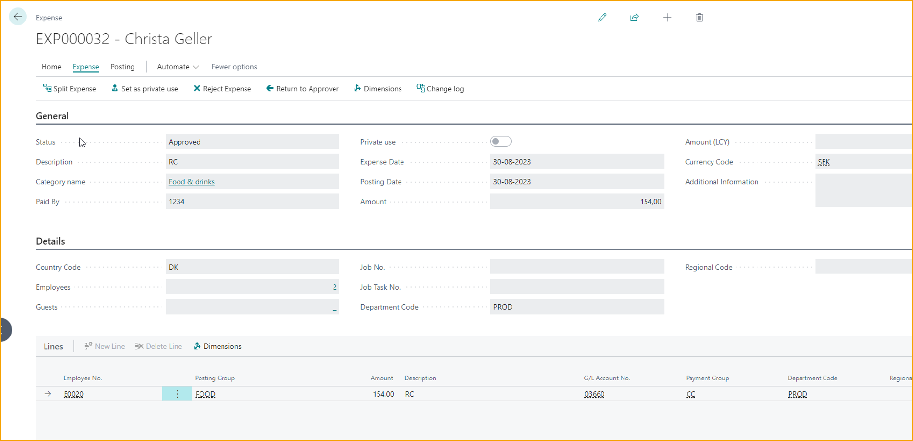

Die Zeilen werden nun entsprechend den ausgewählten Mitarbeitern aufgeteilt.

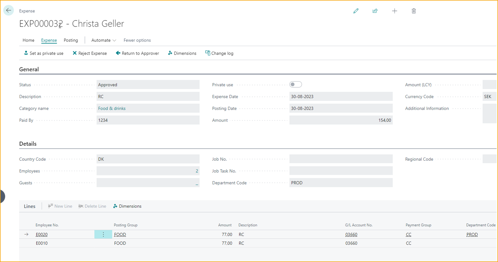

#### Als private Nutzung kennzeichnen

Wenn der Mitarbeiter die Firmenkreditkarte privat genutzt hat und dies bei der Ausgabe vergessen hat zu markieren, kann der Buchhalter dies tun.

Gehen Sie zu: **Bearbeiten --> Als private Nutzung kennzeichnen**

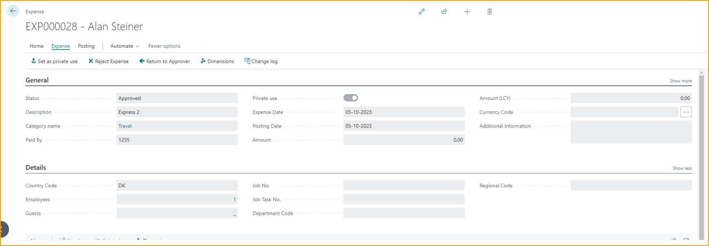

Nachdem die Ausgabe **als private Nutzung gekennzeichnet** und gebucht wurde. Navigieren Sie zu den privaten Einträgen in **Mitarbeiter Private Nutzung.**

Gehen Sie zu: **Mitarbeiter Private Nutzung (TEM)**

Klicken Sie auf **Private Nutzungseinträge berechnen**, die Einträge werden nun angezeigt.

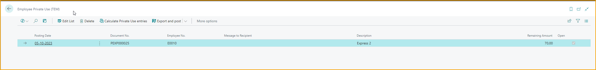

Exportieren Sie die Einträge nach Excel, indem Sie auf **Exportieren und buchen** klicken.

 

#### Ausgabe ablehnen

Wenn der Buchhalter eine Ausgabe ablehnen muss, befolgen Sie bitte die unten stehenden Anweisungen:

Gehen Sie zu: **Bearbeiten --> Ausgabe ablehnen**

Die Ausgabe wird an den Mitarbeiter zurückgesendet; der Buchhalter muss einen Grund für die Ablehnung angeben.

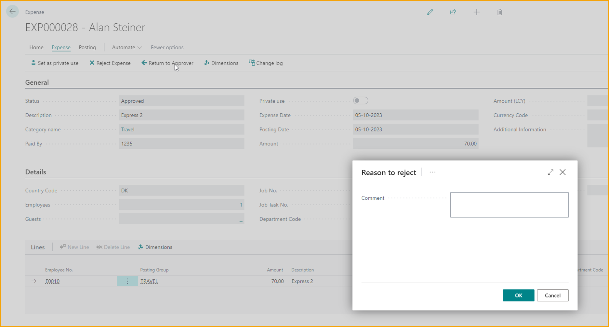

#### An den Genehmiger zurücksenden

Wenn der Buchhalter eine Ausgabe ablehnen muss, befolgen Sie bitte die unten stehenden Anweisungen:

Gehen Sie zu: **Bearbeiten --> An den Genehmiger zurücksenden**

Die Ausgabe wird an den Genehmiger zurückgesendet; der Buchhalter muss einen Grund für die Ablehnung angeben.

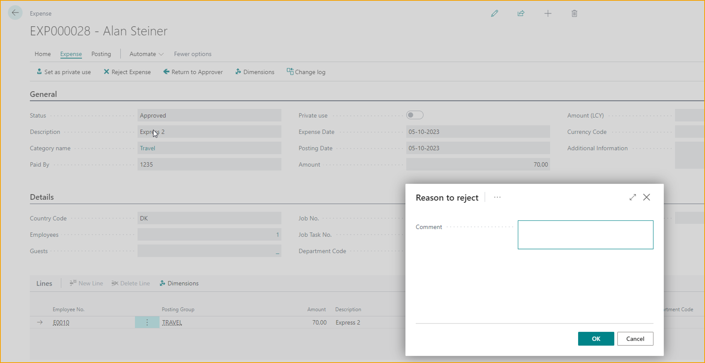

 

### Kilometergeld

Nachdem das Kilometergeld eingereicht und genehmigt wurde, kann es vom Buchhalter in Business Central bearbeitet werden. Die Bearbeitung einer Ausgabe kann verschiedene Elemente umfassen, wie zum Beispiel:

-   Buchen des Kilometergeldes.

-   Bearbeiten des Kilometergeldes.

-   Zurücksendung des Kilometergeldes an den Genehmiger oder vollständige Ablehnung.

#### Eine Ausgabe buchen

Das Buchen einer genehmigten Ausgabe kann in wenigen Schritten erfolgen.

Gehen Sie zu: **Bereit zum Buchen** oder suchen Sie nach: Ausgaben (TEM)

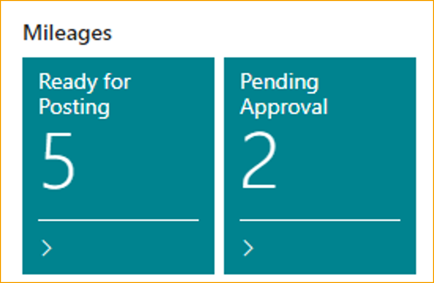

Buchen Sie das Kilometergeld, indem Sie **F9** drücken oder **Buchen** auswählen.

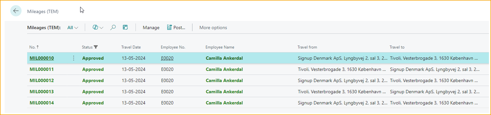

Es ist nur möglich, Ausgaben mit dem Status **Genehmigt** (grüne Farbe) zu buchen.

 

### Kreditkartentransaktionen

Kreditkartentransaktionen können auf verschiedene Weise über Business Central abgewickelt werden, die beide den Arbeitstag eines Buchhalters effizienter gestalten können. Im Folgenden sind die wichtigsten Optionen zur Handhabung von Kreditkartentransaktionen aufgeführt:

-   Manuelles Erstellen von Kreditkartentransaktionen.

-   Bearbeiten von Kreditkartentransaktionen.

 

### Manuelles Erstellen von Kreditkartentransaktionen

Die manuelle Transaktionsliste ist nützlich, wenn Sie physische Rechnungen von Ihrem Kreditkartenanbieter erhalten oder anderweitig nicht in der Lage sind, den automatischen Import zu verwenden. Durch das Erstellen von Transaktionseinträgen für jede einzelne Ausgabe auf der Rechnung kann der Buchhalter die Kreditkartentransaktionen mit den Ausgaben in **AppsForDynamics365.com** abgleichen.

Der Buchhalter kann entweder die Transaktion erstellen, indem er die korrekten Daten in jedes der Felder eingibt, oder indem er eine Datei in einem bei der Einrichtung der **Kreditkartenvereinbarung** gewählten Format importiert.
 

#### Manuelles Erstellen einer Kreditkartentransaktion durch Eingabe von Daten:

Gehen Sie zu: **Manuelle Kreditkartentransaktionen (TEM)**

**Neu:** Erstellen Sie eine neue Kreditkartentransaktion.

**Mitarbeiter:** Wählen Sie aus, wer die Ausgabe getätigt hat.

**Transaktionsdatum:** Geben Sie das Datum ein, an dem der Mitarbeiter die Ausgabe getätigt hat.

**Kartennummer:** Aus einer Liste von mitarbeiterspezifischen Kartennummern

**Beschreibung:** Geben Sie eine Beschreibung der Ausgabe ein.

**Transaktionswährung:** Wählen Sie die verwendete Währung aus.

**Transaktionsbetrag**: Geben Sie den Betrag der Transaktion ein.

**Abrechnungsbetrag**: Geben Sie den Abrechnungsbetrag ein.

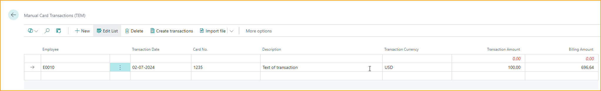

Klicken Sie auf **Transaktionen erstellen**, um die Transaktion an alle Karteninhaber zu senden, sie erhalten eine Benachrichtigung in der App.

 

#### Manuelles Erstellen von Kreditkartentransaktionen durch Import einer Datei

Gehen Sie zu: **Manuelle Kreditkartentransaktionen (TEM)**

**Datei importieren:** Wählen Sie die Importdatei aus

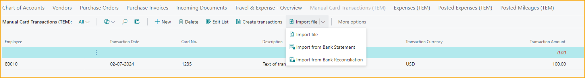

Der Buchhalter hat drei Optionen, um Transaktionen aus **Datei importieren** zu importieren.

1.  Importieren einer Excel-Datei

2.  Importieren aus dem Kontoauszug

3.  Importieren aus der Bankabstimmung

 

#### Anzeigen und Bearbeiten von Transaktionen

In der Ansicht der Kreditkartentransaktionen werden die folgenden Informationen angezeigt:

Gehen Sie zu: **Firmenkartentransaktion (TEM)**

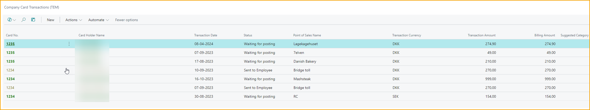

**Kartennummer:** Die Nummer der betreffenden Kreditkarte.

**Name des Karteninhabers:** Der Name des Mitarbeiters, der die Karte besitzt.

**Transaktionsdatum:** Das Datum, an dem die Transaktion stattgefunden hat.

**Status:** Der Status der Transaktion, der von ''An Mitarbeiter gesendet'' bis ''Warten auf Buchung'' reicht und jeden Schritt dazwischen dokumentiert.

**Name des Verkaufsortes:** Der Name des Ortes, an dem der Kauf getätigt wurde.

**Transaktionswährung:** Die für die Transaktion verwendete Währung.

**Transaktionsbetrag:** Der ausgegebene Geldbetrag.

**Abrechnungsbetrag:** Der Betrag, der dem Mitarbeiter erstattet werden soll.

**Vorgeschlagene Kategorie:** Die Kategorie wird basierend auf dem Händlercode und früheren Entscheidungen vorgeschlagen.

 

### Eine Transaktion als bearbeitet markieren

Gehen Sie zu: **Manuelle Kreditkartentransaktionen (TEM)**

Sobald eine Transaktion erstellt wurde, besteht die Hauptoption zur Bearbeitung darin, sie als bearbeitet zu markieren. Dieser Schritt wird unternommen, bevor der betreffende Mitarbeiter die Transaktion bearbeitet und wird in Fällen verwendet, in denen die Transaktion irrelevant geworden ist.

Um eine Transaktion als bearbeitet zu markieren, gehen Sie wie folgt vor.

1.  Wählen Sie eine Transaktion aus.

2.  Wählen Sie in der Aktionsleiste **Aktionen**, dann **Transaktion als bearbeitet markieren**.

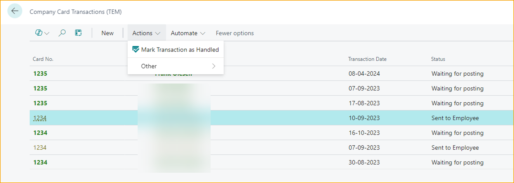

### Tagegeld

Nachdem ein Tagegeld eingereicht und genehmigt wurde, kann es von der Finanzabteilung in Business Central bearbeitet werden.

#### Ein Tagegeld buchen

Das Buchen einer genehmigten Ausgabe kann in wenigen Schritten erfolgen.

Gehen Sie zu: **Bereit zum Buchen**

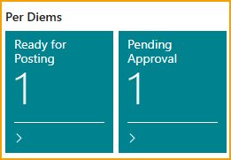

Buchen Sie eine Ausgabe, indem Sie **F9** drücken oder **Buchen** auswählen.

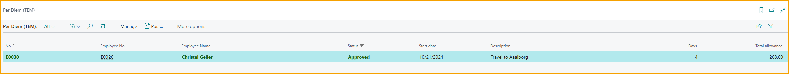

Der Benutzer kann nur Tagegelder mit dem Status **Genehmigt** (grüne Farbe) buchen.

 

### Erstattung

Sobald die Ausgaben dem Mitarbeiter in Business Central zugewiesen wurden, sind sie zur Erstattung verfügbar. Abhängig von der Erstattungseinrichtung wird der Prozess entweder über das Zahlungstagebuch in Business Central oder über den Dateiexport abgeschlossen.

Gehen Sie zu: **Ausstehende Erstattung**
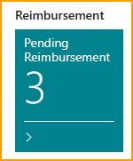

Gehen Sie zu: **Einträge vorschlagen**
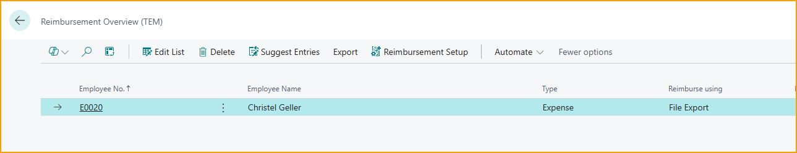

#### Zahlungstagebuch
Erstattung über das Zahlungstagebuch.
Gehen Sie zu: **Zahlungszeilen erstellen**
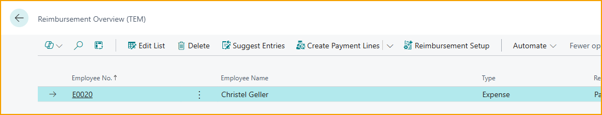

Benutzer werden zum Zahlungstagebuch in Business Central weitergeleitet.
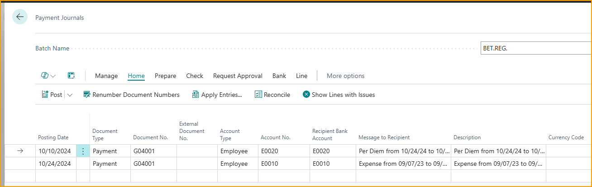

#### Dateiexport
Für die Erstattung über den Dateiexport.
Gehen Sie zu: **Exportieren**
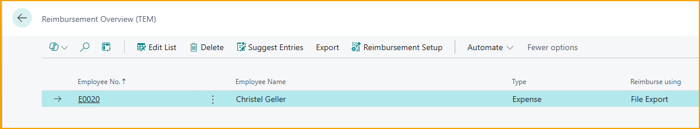

Buchen Sie eine Ausgabe, indem Sie auf **Exportieren und Buchen** klicken.

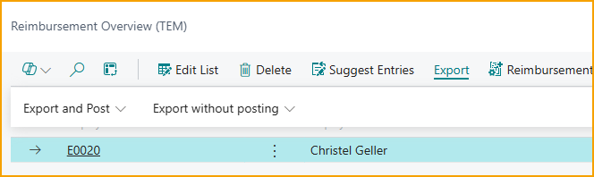

Die generierte Datei befindet sich im Download-Ordner.

