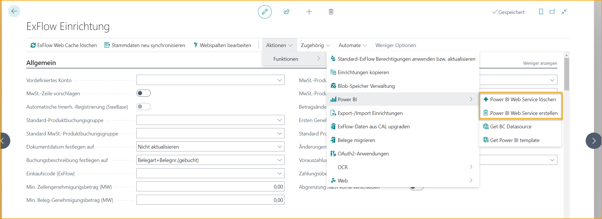

## Power BI

Es gibt vorbereitete Einstellungen und Vorlagen, um ExFlow-Daten mit Power BI zu analysieren. Da das Thema umfangreich ist, hat SignUp auch einen speziellen [***Knowledge Base-Artikel***](https://support.signupsoftware.com/knowledgebase/article/KA-01291) veröffentlicht, der die Integration abdeckt. Der Knowledge Base-Artikel kann im Support-Portal von Support-Portal-Benutzern gefunden werden. Power BI-Vorlagen (BCO/BC Onprem) können auch von Partnern im [***Partner Portal***](https://azuresignup.sharepoint.com/sites/Signupsoftware/SitePages/BC-POWER-BI.aspx?xsdata=MDV8MDJ8fDU2YzBmOTZlYjUxZjRmMjg0MzNmMDhkYzg0NmE3MmIwfDg3NzkxMTdkNzcyZTRlYTU5NGVjNDRhMWExZDA0MjdifDB8MHw2Mzg1MzA4Mzk5MDUzMjE3OTF8VW5rbm93bnxWR1ZoYlhOVFpXTjFjbWwwZVZObGNuWnBZMlY4ZXlKV0lqb2lNQzR3TGpBd01EQWlMQ0pRSWpvaVYybHVNeklpTENKQlRpSTZJazkwYUdWeUlpd2lWMVFpT2pFeGZRPT18MXxMMk5vWVhSekx6RTVPbUZpTVRJNU1EWXlNVEExWlRSaFkyTTVaR05pWVRBNE1EUTFNR1JpTkRSbVFIUm9jbVZoWkM1Mk1pOXRaWE56WVdkbGN5OHhOekUzTkRnM01UZzVPRFExfDY3MTk3NmJkNzFmZTQ4YmQ0MzNmMDhkYzg0NmE3MmIwfDIyZmJkZjM2ZjZhNTRjNjE5MzIxYWNkOTY5YTFmYThl&sdata=UkdFQTF4T2Vra3R2Vk5sMUYxTXpWbkdZcXE4OEUxZ3h1WEZhcUhlN0NpMD0%3D&ovuser=8779117d-772e-4ea5-94ec-44a1a1d0427b%2Csofia.nikolic%40signupsoftware.com&OR=Teams-HL&CT=1717489911732&clickparams=eyJBcHBOYW1lIjoiVGVhbXMtRGVza3RvcCIsIkFwcFZlcnNpb24iOiI0OS8yNDA1MDMwNzYxNCIsIkhhc0ZlZGVyYXRlZFVzZXIiOmZhbHNlfQ%3D%3D) gefunden werden.

Aus einer Einrichtungsperspektive können alle benötigten Webdienste in einem Unternehmen veröffentlicht werden, indem "Create Power BI Web Services" ausgewählt wird.

***Setup \--\> ExFlow Setup \--\> Actions \--\> Functions \--\> Power BI
\--\> Create Power BI Web Services***

Um vorhandene Power BI-Webdienste zu löschen, wählen Sie "Delete Power BI Web Services".

***Setup \--\> ExFlow Setup \--\> Actions \--\> Functions \--\> Power BI
\--\> Delete Power BI Web Services***

Unter Power BI Setups ist es auch möglich, die Power BI-Vorlagendatei herunterzuladen, und während dieser Einrichtung gibt es nun eine einfachere Möglichkeit, die URL-Zeichenfolge (BC-Datenquelle) abzurufen, die während der Power BI-Einrichtung in Power BI Desktop verwendet wird. Diese Einrichtungen werden im Knowledge Base-Artikel behandelt.

### Zugriff auf veröffentlichte Dokumente in Business Central von Power BI Desktop aus

Ab ExFlow-Version 21.1 ist es möglich, Links in Power BI zu erstellen, um veröffentlichte Einkaufsdokumente anzuzeigen. Es ist erforderlich, Zugriff auf die spezifische Seite in Business Central zu haben, um das Dokument sehen zu können. Um diese Funktionalität zu nutzen, stellen Sie sicher, dass die neuesten ExFlow Power BI-Webdienste verwendet werden, indem Sie sie löschen und erneut erstellen. In der neuesten ExFlow Power BI-Vorlagendatei gibt es einen vorbereiteten Bericht namens "Posted Documents".

Klicken Sie auf den Dokumentenlink, um zur Karte des veröffentlichten Dokuments in ExFlow Approval Status History zu gelangen.

