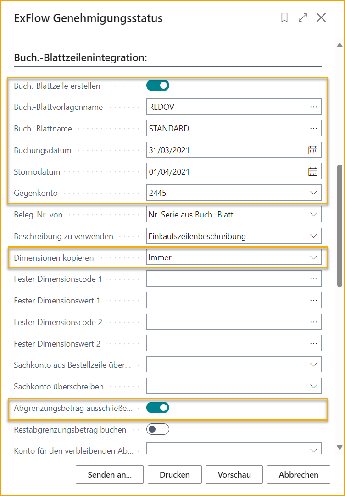

## Berichte

Gehen Sie zu ExFlow Berichte, um Berichte zu generieren. Die Berichte sind nach folgenden Abschnitten unterteilt:

### Berichte --> Dokumente

| Berichte --> Dokumente |  | 
|:-|:-|
| **ExFlow Genehmigungsstatus:**        | Verfolgen Sie den Genehmigungsstatus und buchen Sie am Monatsende ausstehende Kosten
| **ExFlow veröffentlichte genehmigte Dokumente:**        | Zeigen Sie genehmigte Dokumente pro Genehmiger an
| **ExFlow offene Dokumente:**        | Zeigen Sie aktuell offene ExFlow Dokumente an
| **ExFlow Dokumentengenehmigungsverlauf:**        | Zeigen Sie veröffentlichte ExFlow Dokumente an
| **ExFlow Dokumente pro Unternehmen:**        | ExFlow Statistiken in allen Unternehmen, um das aktuelle Jahr mit dem Vorjahr zu vergleichen
| **ExFlow Import Journal Dokumente mit Fehlern:**        | Exportiert eine Liste von Import Journal Dokumenten (und zugehörigen Zeilen) mit Fehlern
| **ExFlow vorläufige Verbindlichkeiten:**        | Zeigen Sie den Verbindlichkeitsbericht an und filtern Sie nach vorläufig gebuchten Kosten
| **ExFlow fällige Verbindlichkeiten:**        | Zeigen Sie den Bericht über fällige ExFlow Verbindlichkeiten an

 

### ExFlow Genehmigungsstatus

Gehen Sie zu: ***ExFlow Berichte \--\> Dokumente \--\> ExFlow Genehmigungsstatus***

Dieser Bericht zeigt alle Dokumente an, die noch auf Genehmigung warten und noch nicht gebucht wurden. Verwenden Sie z.B. den Filter für das Fälligkeitsdatum, um Dokumente für einen bestimmten Zeitraum anzuzeigen. Wählen Sie im Tab "Optionen" aus, welche Dokumente gedruckt werden sollen.

#### Vorläufige Kosten buchen

Dieser Bericht kann auch verwendet werden, um einen Hauptbuch mit Buchungen zu füllen, mit denen vorläufige Kosten (pro Einkauf) für noch nicht endgültig zertifizierte Dokumente gebucht werden können. Im folgenden Beispiel treten folgende Ereignisse auf:

- Für alle **Aktiven** (d.h. noch zur Genehmigung ausstehenden) Dokumentzeilen vom Typ **G/L Account** wird ein Eintrag im Hauptbuch und im Standard-Batch erstellt.

- Das Datum der Buchung wird auf **2021-03-31** festgelegt.

- Die G/L Account-Nummer wird von der Einkaufszeile übernommen und der Saldo für den G/L Account wird auf **2445** festgelegt.

- Es wird auch eine umgekehrte Buchung mit dem Buchungsdatum **2021-04-01** auf demselben G/L Account mit entgegengesetzten Vorzeichen erstellt.

- Alle Zeilen, für die ein Deferral Start Date für eine Buchung nach dem 2021-03-31 festgelegt ist, werden nicht berücksichtigt. Dies liegt daran, dass das Feld **"Exclude Deferral Amount occurring after Posting Date:"** aktiviert ist.

##### Weitere Einstellungen zur Integration von Journalzeilen

###### Optionen

**Nur G/L Zeilen einbeziehen:**

Nur G/L Accounts in den Vorschlag für das Hauptbuch aufnehmen. Wenn nicht ausgewählt, werden alle Zeilentypen einbezogen. Positionen werden durch einen G/L Account ersetzt, der auf den allgemeinen Buchungseinstellungen basiert.

**Nicht genehmigte Zeilen ausschließen:**

Wenn diese Option nicht ausgewählt ist, werden alle Rechnungen/Gutschriften und Zeilen in den ExFlow Genehmigungsstatus einbezogen. Durch Auswahl dieser Option wird sichergestellt, dass nur von ExFlow generierte Rechnungs-/Gutschriftszeilen einbezogen werden.

**Währungskurs basierend auf:**

Rechnungen/Gutschriften in anderen Währungen als der LCY müssen in die LCY umgerechnet werden.

Heutiges Datum: Der Währungsumrechnungskurs wird basierend auf dem heutigen Datum berechnet.

Buchungsdatum des Dokuments: Der Währungsumrechnungskurs wird basierend auf dem Buchungsdatum jedes Quelldokuments berechnet.

Währungsfaktor aus dem Einkaufskopf: Der (vorhandene) Wechselkurs aus dem Quelldokument wird verwendet.

###### Integration von Journalzeilen

**Dimensionen kopieren:**

Kopieren Sie die Dimensionen von den Quelldokumenten in die vorgeschlagenen Hauptbuchzeilen.

**G/L Account von der Einkaufszeile überschreiben:**

Die leere Option schlägt den G/L Account aus der Quelleinkaufszeile vor.

Immer: Ersetzen Sie alle G/L Accounts durch den unten ausgewählten G/L Account.

Wenn die Zeile das vordefinierte Konto hat: Ersetzen Sie G/L Accounts aus Einkaufszeilen nur, wenn sie mit dem vordefinierten Konto übereinstimmen.

**Überschreiben des G/L-Kontos:**

Das für die obige Einstellung verwendete G/L-Konto.

**Ausschließen von Deferral-Beträgen nach dem Buchungsdatum:**

Ja: Zeilen mit einem Deferral-Startdatum nach dem Buchungsdatum werden nicht einbezogen.

Nein: Alle Deferral-Buchungen werden einbezogen.

**Verbleibende Deferral-Beträge buchen:**

Verbleibende Deferral-Beträge aufgrund von Deferral-Vorlagen auf das unten ausgewählte G/L-Konto buchen.

**Konto für verbleibende Deferral-Beträge:**

Das für die obige Einstellung verwendete G/L-Konto.

**Buchungsoptionen für Positionen:**

Optionen sind Vollständig oder nur Inventarkonto.

**Buchung von Jobinformationen:**

Gibt an, ob Jobinformationen beim Erstellen der Position einbezogen werden sollen.

Fügen Sie weitere erforderliche Filter hinzu:

 

### ExFlow Genehmigte Dokumente

Gehe zu: ***ExFlow Berichte \--\> Dokumente \--\> ExFlow Genehmigte Dokumente***

Der Bericht "ExFlow Genehmigte Dokumente" zeigt Dokumente gruppiert nach Genehmiger an. Er kann auch Dokumente enthalten, die gebucht wurden und/oder einen Filter für nur einen Genehmiger haben. Kann in Excel exportiert werden.

 

### ExFlow Offene Dokumente

Gehe zu: ***ExFlow Berichte \--\> Dokumente \--\> ExFlow Offene Dokumente***

Dieser Bericht kann verwendet werden, um offene Dokumente für eine bestimmte oder mehrere Genehmigungsgruppen anzuzeigen.

 

### ExFlow Dokumentgenehmigungshistorie

Gehe zu: ***ExFlow Berichte \--\> Dokumente \--\> ExFlow Dokumentgenehmigungshistorie***

Dieser Bericht kann verwendet werden, um die Genehmigungshistorie für "Gebuchte Dokumente" für Genehmigungsgruppen und Genehmiger anzuzeigen.

Dieser Bericht gibt auch Auskunft darüber, ob eine Rechnung automatisch gegen eine Bestellung oder einen Vertrag genehmigt wurde. Die letzte Spalte rechts zeigt: "Vertragsnummer" für das Dokument, "Bestellnummer" für die Positionen und "Automatisch genehmigt" für die Genehmigungspositionen.
 

### ExFlow Dokumente pro Unternehmen

Gehe zu: ***ExFlow Berichte \--\> Dokumente \--\> ExFlow Dokumente pro Unternehmen***

Dieser Bericht kann verwendet werden, um die Anzahl der ExFlow-Dokumente pro Unternehmen und die Anzahl der Genehmiger pro Unternehmen anzuzeigen.

 

### ExFlow Import Journal-Dokumente mit Fehlern
Gehe zu: ***ExFlow Berichte \--\> Dokumente \--\> ExFlow Import Journal-Dokumente mit Fehlern***

Laden Sie eine Excel-Datei mit allen Import Journal-Dokumenten mit Fehlern herunter. Wählen Sie, ob Sie "Alle Positionen" aktivieren möchten, und auch, ob ein bestimmter "Journal-Batch-Name" angegeben werden soll. Klicken Sie dann auf OK, um die Datei herunterzuladen.

 

### ExFlow Vorläufige Verbindlichkeiten
Gehe zu: ***ExFlow Berichte \--\> Dokumente \--\> ExFlow Vorläufige Verbindlichkeiten***

Generieren Sie einen Bericht mit Filter für vorläufige Buchungen. Geben Sie an, ob der Bericht alle Dokumente, nur vorläufig gebuchte Dokumente oder Dokumente ohne vorläufige Buchungen anzeigen soll.

Es ist auch möglich, nach Lieferantennummer usw. zu filtern.

Im folgenden Beispiel zeigt der Bericht nur vorläufige gebuchte Dokumente ohne weitere Filtereinstellungen.

 

### ExFlow-Verbindlichkeiten nach Alter
Gehe zu: ***ExFlow-Berichte \--\> Dokumente \--\> ExFlow-Verbindlichkeiten nach Alter***

Generieren Sie einen Bericht über die Alterung von Dokumenten und lassen Sie ExFlow festlegen, ob die Alterung vom Fälligkeitsdatum, dem Buchungsdatum oder dem Dokumentdatum aus berechnet wird, sowie weitere Filter.

Im folgenden Beispiel wird der Bericht mit den Filtern ''Alterung nach: Fälligkeitsdatum'' und ''Überschriftstyp'' als ''Datumsintervall'' generiert und es werden auch vorläufige gebuchte Dokumente ausgeschlossen.

  

### Berichte --> ExFlow-Benutzer

| Berichte --> Benutzer |  | 
|:-|:-|
| **ExFlow-Benutzer:**        | ExFlow-Benutzer und ihre Details in allen Unternehmen
| **ExFlow-Genehmigungsverfolgung:**        | Anzeigen der aktuellen ExFlow-Dokumente pro Benutzer
| **ExFlow-Genehmigerstatistik:**        | Anzeigen der Leistung des Genehmigers
| **ExFlow-Benutzervertretungen:**        | Überprüfen Sie Vertreter für alle ExFlow-Benutzer
| **ExFlow-GDPR-benutzerbezogene Daten:**        | Anzeigen, wo personenbezogene Daten in ExFlow verwendet werden 

 

### ExFlow-Benutzer

Gehe zu: ***ExFlow-Berichte \--\> Benutzer \--\> ExFlow-Benutzer***

Dieser Bericht zeigt sowohl ExFlow-Benutzer als auch Benutzereinrichtungen für alle Unternehmen an.
Mit verschiedenen Filteroptionen.

 

### ExFlow-Genehmigungsverfolgung

Gehe zu: ***ExFlow-Berichte --> Benutzer --> ExFlow-Genehmigungsverfolgung***

Dieser Bericht kann verwendet werden, um Genehmiger mit nicht genehmigten Dokumentzeilen zu verfolgen. Fügen Sie einen Filter für eine bestimmte "Genehmigungsgruppe" hinzu.

 

### ExFlow Genehmiger Statistiken

Gehe zu: ***ExFlow Berichte \--\> Benutzer \--\> ExFlow Genehmiger Statistiken***

Dieser Bericht liefert Administratoren/Benutzern Statistiken für die Genehmiger, z. B. "Anzahl der genehmigten Zeilen, durchschnittliche Anzahl der Genehmigungstage".

 

### ExFlow Benutzervertretungen

Gehe zu: ***ExFlow Berichte \--\> Benutzer \--\> ExFlow Benutzervertretungen***

Dieser Bericht zeigt Benutzervertretungen für verschiedene Benutzer in verschiedenen Zeiträumen. Administratoren/Benutzer können entweder nach einem bestimmten Benutzer oder nach "Allen Benutzern" filtern.

 

### ExFlow GDPR Benutzerbezogene Daten

Gehe zu: ***ExFlow Berichte \--\> Benutzer \--\> ExFlow GDPR Benutzerbezogene Daten***

Dieser Bericht zeigt alle GDPR-bezogenen Daten für einen bestimmten Benutzer.

  

### Berichte --> Genehmigungsregeln

| Berichte --> Genehmigungsregeln |  | 
|:-|:-|
| **ExFlow Genehmigungsregeln:**        | Detaillierte Ansicht aller für den ExFlow-Workflow definierten Genehmigungsregeln
| **ExFlow Genehmigungsregeln pro Benutzer:**        | Ansicht der Genehmigungsregeln pro Benutzer
| **ExFlow Genehmigungsregelliste:**        | Ansicht der Liste der Genehmigungsregeln

 

### ExFlow Genehmigungsregeln

Gehe zu: ***ExFlow Berichte \--\> Genehmigungsregeln \--\> ExFlow Genehmigungsregeln***

Dieser Bericht zeigt "Genehmigungsregeln" nach Unternehmen. Es gibt verschiedene Filteroptionen wie "Lieferant" oder "Dimension Wert", die ebenfalls angewendet werden können.

Aktivieren Sie das Kontrollkästchen "Genehmigungsgruppenzeilen anzeigen", um Informationen zu den Genehmigungsgruppenzeilen in den Bericht aufzunehmen.

 

### ExFlow Genehmigungsregeln pro Benutzer

Gehe zu: ***ExFlow Bericht \--\> Genehmigungsregeln \--\> ExFlow Genehmigungsregeln pro Benutzer***

Dieser Bericht zeigt "Genehmigungsregeln pro Benutzer" mit Filteroptionen nach "Unternehmen", "Benutzer-ID" und so weiter. Administratoren/Benutzer können auch Benutzervertretungen für ein bestimmtes Datum einschließen.

 

### ExFlow Genehmigungsregelliste
Gehe zu: ExFlow Bericht --> Genehmigungsregeln --> ExFlow Genehmigungsregelliste

Generieren Sie einen Bericht basierend auf allen Genehmigungsregeln oder ausgewählten Regeln.

