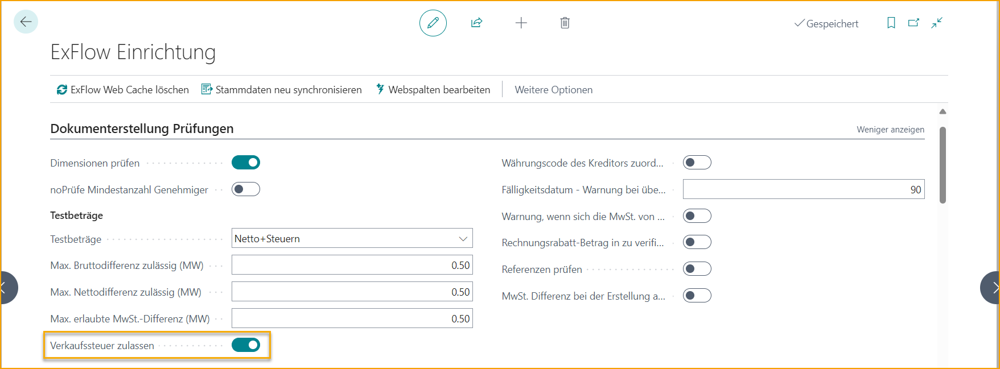
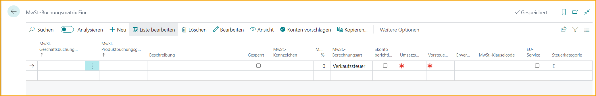
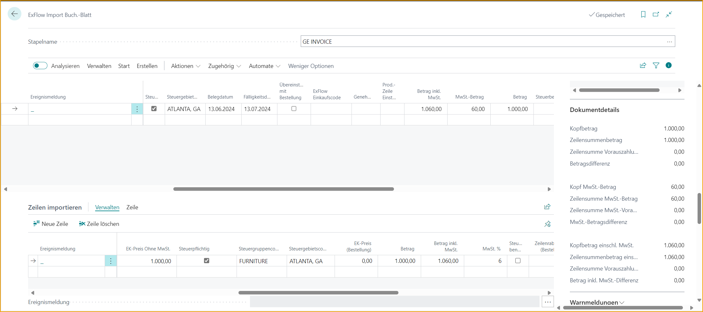
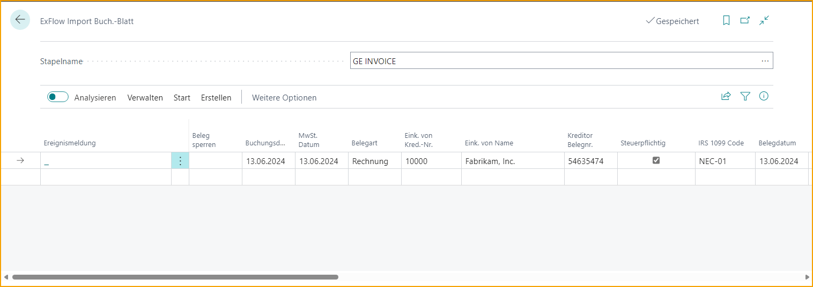
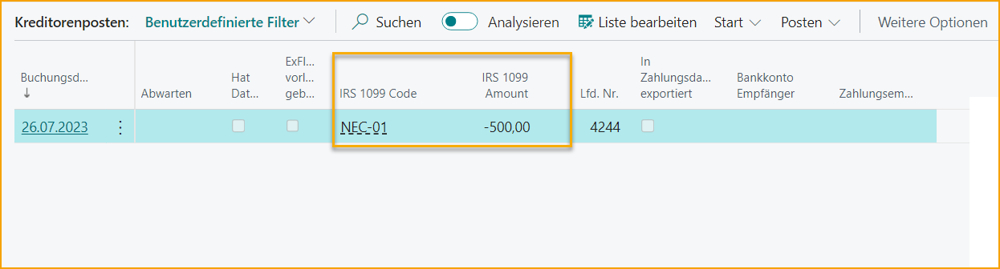
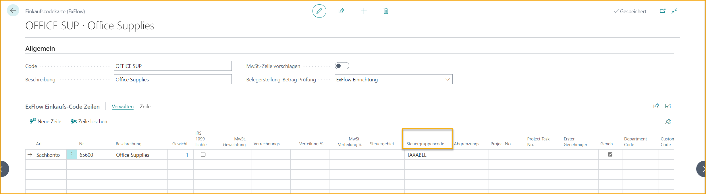
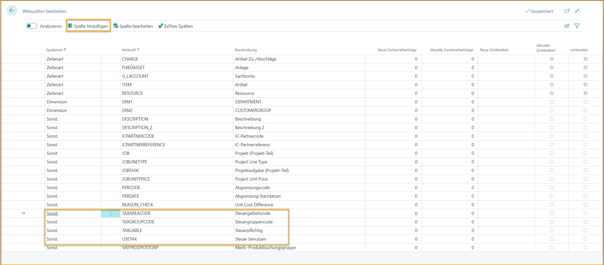

## Lokalisierung USA

### US-Verkaufssteuer

Gehen Sie zu: ***Setup \--\> ExFlow Setup \--\> Doc. Creation Checks Tab***

Aktivieren Sie "Allow Sales Tax" in ExFlow Setup.

Mit dieser Einstellung wird die MwSt. Product Posting Group im ExFlow Import Journal nicht zwingend erforderlich sein. Diese Einstellung wird normalerweise mit dem Tax Posting Setup der Verkaufssteuer kombiniert.

Um die US-Verkaufssteuer zu unterstützen, werden die steuerrelevanten Felder aus dem Purchase Document Header und den Purchase Document Lines auch im ExFlow Import Journal implementiert. Die Funktionalitäten dieser Felder sind ähnlich wie in den Purchase Documents.

**Die zusätzlichen Felder im Dokumentenkopf sind**

- Tax Liable
- Tax Area Code
- Tax Exemption No.

**Und in den Dokumentzeilen**

- Tax Liable
- Tax Area Code
- Tax Group Code

Mit der Verwendung des US Tax Setup unterstützt das Import Journal auch Steuerberechnungen basierend auf der US-Steuer. Die Funktionalität zum Abrufen des Tax Area Code usw. aus den Unternehmensinformationen und dem Standort anstelle der Vendor Card wird ebenfalls im Import Journal berücksichtigt.

### 1099-pflichtige Transaktionen des Lieferanten 
Bevor Sie 1099-pflichtige Transaktionen verarbeiten, müssen Sie **1099 Form Boxes** und **Lieferanten** als 1099-pflichtig in Business Central einrichten. Bitte beziehen Sie sich auf die Microsoft-Dokumentation für Anweisungen zur 1099-Einrichtung und -Transaktionsverarbeitung in Business Central.  

#### So verarbeiten Sie ein Dokument als 1099-pflichtig in ExFlow 
* Importieren Sie eine Rechnung für einen Lieferanten, der mit dem entsprechenden IRS 1099-Code usw. eingerichtet wurde (siehe Microsoft-Anweisungen zur Einrichtung von 1099-Lieferanten).
* Optional können Sie in der Kopfzeile des Import Journals im Feld IRS 1099 Code den Standardwert durch einen anderen Code überschreiben oder ihn löschen, um eine Transaktion ohne IRS 1099-Code zu haben.

* Wenn ein Teil des Rechnungsbetrags 1099-pflichtig ist und ein Teil nicht, aktivieren/deaktivieren Sie das Kontrollkästchen „IRS 1099 Liable“, um Zeilen zu identifizieren, die 1099-pflichtig sind.

* Fahren Sie mit der Verarbeitung fort und buchen Sie das Dokument.
* Sobald das Dokument gebucht ist, können Sie zur Liste der Vendor Ledger Entries gehen und feststellen, dass die Felder IRS 1099 Code und IRS 1099 Amount automatisch ausgefüllt sind.

### Umgang mit dem Tax Group Code im ExFlow Purchase Code

Wenn der Tax Group Code in einer Rechnungszeile anders sein muss als der Standardwert im Master Record, der in dieser Rechnungszeile ausgewählt wurde, kann dies über einen ExFlow Purchase Code gehandhabt werden.

Zum Beispiel, wenn der Tax Group Code auf einer G/L-Kontokarte für Büromaterial standardmäßig auf NON-TAXABLE gesetzt ist, während eine Zeile in einer Einkaufsrechnung mit diesem G/L-Konto als TAXABLE markiert werden muss, könnten Benutzer dies einfach in den ExFlow Purchase Code-Zeilen gemäß dem untenstehenden Bild hinzufügen.

Dies würde es den Benutzern ermöglichen, die Rechnungserstellung in diesen spezifischen Szenarien zu automatisieren.

### Steuer-Spalten im Web

Es ist möglich, steuerrelevante Felder im ExFlow Web sichtbar zu machen, indem die Spalten in ExFlow Setup hinzugefügt werden.

Lesen Sie mehr darüber, wie Sie Web-Spalten bearbeiten, im Abschnitt [***ExFlow Web.***](https://docs.signupsoftware.com/business-central/docs/user-manual/technical/exflow-web#exflow-web)
