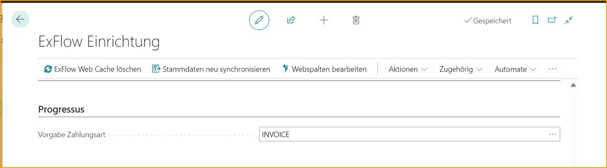
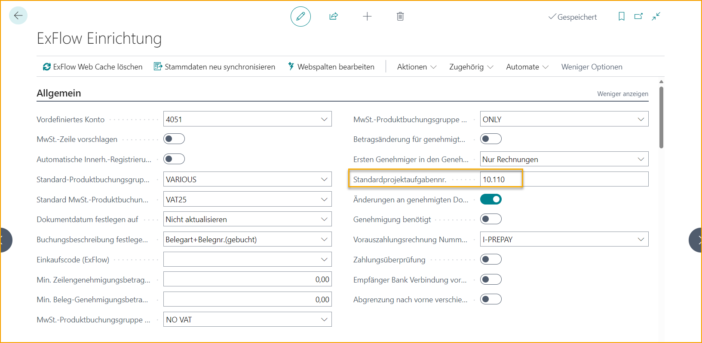
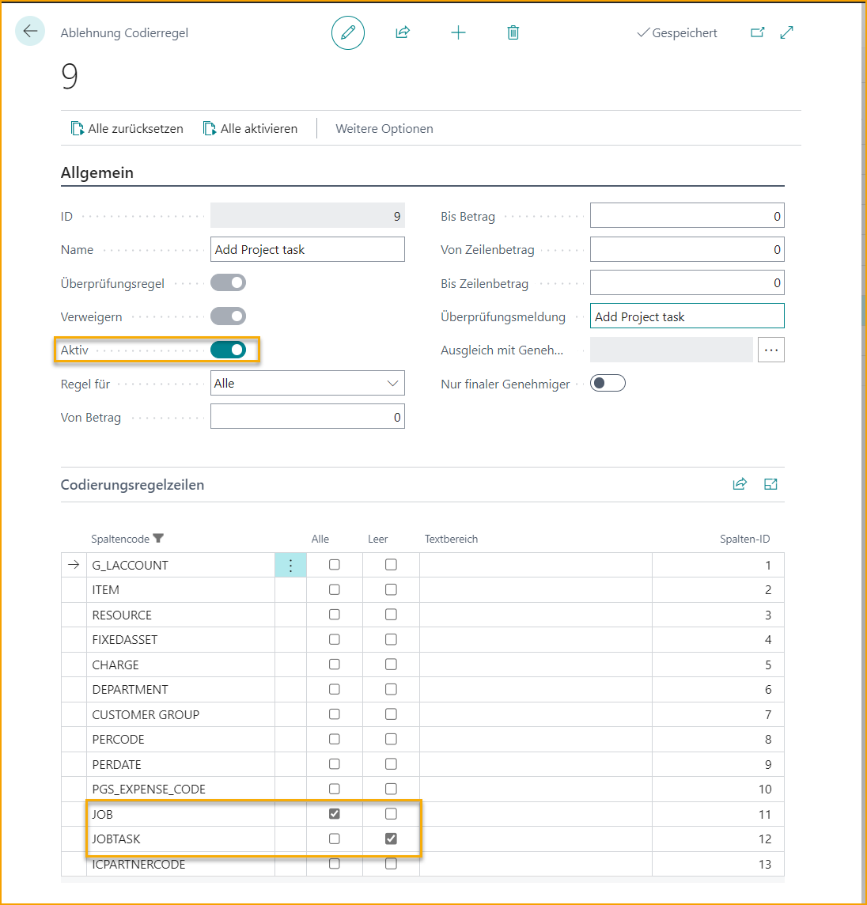
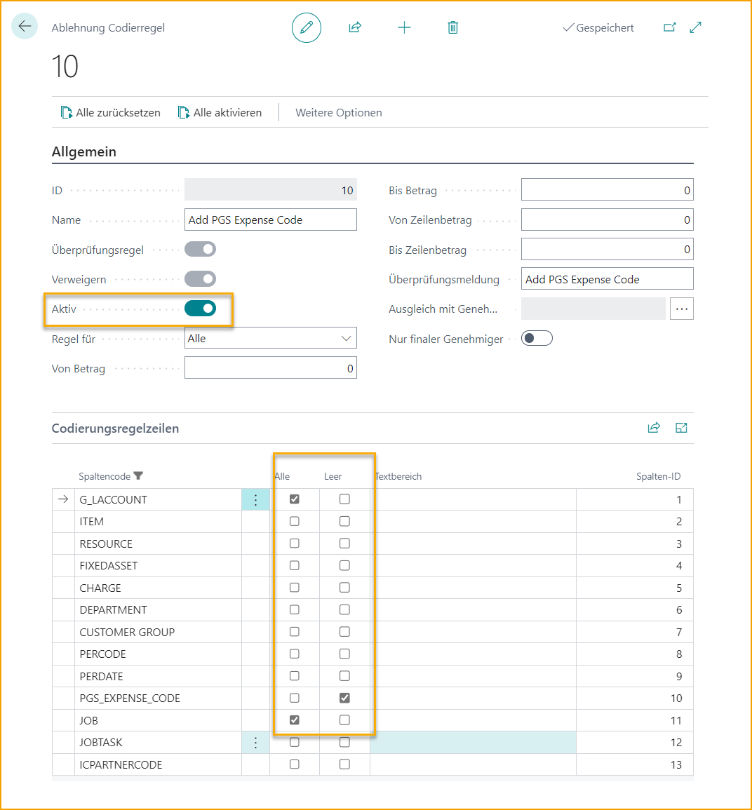
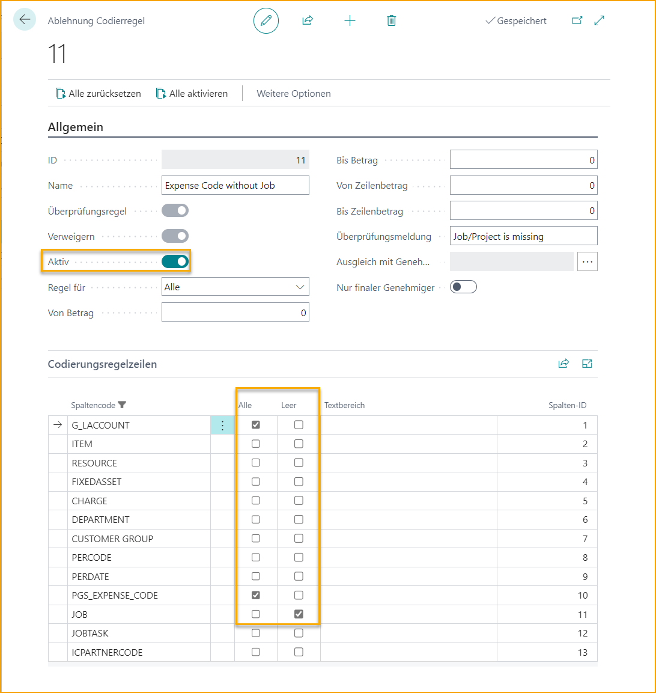

## Progressus

Progressus ist ein Add-On für erweiterte Funktionalität in Projekten.

### ExFlow Setup

Im ExFlow Setup, wie für PGS Expense Code, Projekt und Projektaufgabe und unter Edit Web Columns in dieser Reihenfolge.

Beim Hinzufügen von PGS Expense Code fügt ExFlow automatisch Verweigerungs-Codierungsregeln hinzu, um die Verwendung von PGS Expense Code bei Zeilentypen wie Artikel, Ressource, Anlagevermögen und Gebühr (Artikel) zu verhindern.

Fügen Sie auch PGS Expense Payment Type für Einkaufsdokumente unter dem Schnellregister Progressus hinzu.

Falls möglich, fügen Sie eine Standard-Projektaufgaben-Nr. unter ExFlow Setup --> Allgemein hinzu. Lesen Sie mehr darüber unter **Standard-Projektaufgaben-Nr.**

### ExFlow Verweigerungs-Codierungsregeln mit Progressus

Beim Hinzufügen eines Projekts auf ExFlow Web muss der Genehmiger auch die Projektaufgabe und den PGS Expense Code hinzufügen, falls diese fehlen. Nun kann die folgende Verweigerungs-Codierungsregel nützlich sein.

Eine Erinnerung, die Projektaufgabe hinzuzufügen, wenn ein Projekt auf ExFlow Web verwendet wird.

Eine Erinnerung, den PGS Expense Code hinzuzufügen, wenn ein G/L-Konto und ein Projekt auf ExFlow Web verwendet werden.

Eine Erinnerung, das Projekt hinzuzufügen, wenn ein G/L-Konto und ein PGS Expense Code auf ExFlow Web verwendet werden.

#### Arbeiten mit Expense Resource auf den Dokumentzeilen im Import Journal
Es ist auch möglich, die Felder Expense Resource, Expense Date und Chargeable im Import Journal zu nutzen. Diese Felder müssen manuell durch Personalisierung hinzugefügt werden.

Chargeable wird von der Projektaufgaben-Nr. aktualisiert.  
Bitte beachten Sie jedoch, dass wenn der Zeilentyp: 
•	***Artikel***: dann wird PGS Chargeable von Artikel Chargeable aktualisiert.  
•	***G/L-Konto***: dann wird PGS Chargeable von Expense Chargeable aktualisiert.  

Dies kann manuell auf den Zeilen angepasst werden.  

Darüber hinaus sind diese Felder in den Zeilen der meisten ExFlow-Seiten zu finden: Import Journal, Genehmigungsstatus, Genehmigungsstatus-Historie und Gelöschte Dokumente.

Zusätzlich wird es keine Preisaktualisierungen über Progressus geben. Preise bleiben wie interpretiert.

#### ExFlow Purchase Code für Progressus

PSG Expense Code und PSG Payment Type sind auch im ExFlow Purchase Code verfügbar.

### Progressus Expense Code auf ExFlow Web

Aufgrund der Verweigerungs-Codierungsregeln muss der Genehmiger Projekt, Projektaufgabe und PGS Expense Code auf ExFlow Web hinzufügen, falls diese fehlen. Das G/L-Konto wird automatisch aus der Projektkostenbuchungs-Einrichtung in Business Central hinzugefügt oder aktualisiert.
