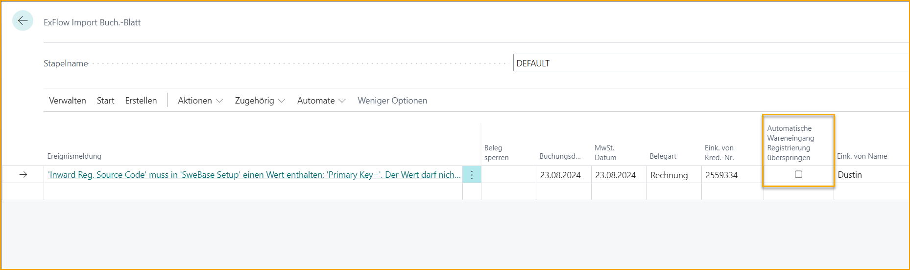

## SweBase

ExFlow unterstützt auch einige Funktionen, die in der Erweiterung SweBase zu finden sind.

Für Fragen zu SweBase wenden Sie sich an Ihren Business Central Partner.

### Zahlungsreferenz - OCR-Nr.

Das Feld OCR-Nr. kann interpretiert und importiert oder manuell im Feld "Belegnr. 2" des Importjournals hinzugefügt werden.

Beim Erstellen eines Dokuments wird dies im Feld OCR-Nr. im Dokumentenkopf hinzugefügt. Nach dem Buchen kann die OCR-Nr. in den Kreditorenposten gefunden werden.

Die Funktionalität zur Handhabung der OCR-Nr. in der Zahlungslösung ist in der Erweiterung SweBase zu finden.

### Wareneingangsbuchung

Die Wareneingangsbuchung kann in der ExFlow-Einrichtung aktiviert werden und wird dann automatisch auf Zeilenebene gebucht, wenn das Dokument aus dem Importjournal erstellt wird.

Beim Buchen des Dokuments werden die Wareneingangsbuchungen am selben Datum wie das Buchungsdatum storniert.

Und wenn ein wareneingebuchtes Dokument gelöscht wird, wird es am Buchungsdatum storniert.

Eine Einrichtung der Wareneingangsbuchung in der SweBase-Einrichtung ist erforderlich und "Buchungsdatum nach Wareneingangsbuchung beibehalten" muss auf wahr gesetzt sein.

Um Wareneingangsbuchungen mit Rundung buchen zu können, fügen Sie die Einrichtung der Wareneingangs-Mehrwertsteuerbuchung hinzu.

#### Warnmeldungen für Wareneingangsbuchung

Wenn es aufgrund eines Fehlers nicht möglich ist, automatisch zu buchen, besteht die Möglichkeit, eine Spalte namens "Autom. Wareneingangsbuchung überspringen" im Importjournal-Kopf zu personalisieren. Aktivieren Sie diese Funktion und das Dokument kann ohne Wareneingangsbuchung erstellt werden. Die Wareneingangsbuchung kann dann manuell aus der Karte gebucht werden.

### Warenvermerk

Das Feld Warenvermerk kann interpretiert und importiert oder manuell im Importjournal hinzugefügt werden.

Dies kann für Freitext verwendet werden, wird jedoch nicht auf ExFlow Web angezeigt.

### Erweiterte Buchungsdatum für Buchungen mit Abgrenzung

In der SweBase-Einrichtung gibt es eine Einstellung, um das "Erlaubte Buchungsdatum" bei der Buchung von Abgrenzungen zu erweitern.

Dies ermöglicht es dem Administrator, das Dokument im Importjournal zu überprüfen und zu erstellen. Auch zur Überprüfung und Buchung im Genehmigungsstatus.

### Aktualisierung der Mehrwertsteuer-Produktbuchungsgruppe

In SweBase gibt es eine Funktion zur Umkehrung der Steuerschuld für bestimmte Waren und Dienstleistungen.

Die gleiche Funktion kann im ExFlow-Importjournal verwendet werden, um die Mehrwertsteuer-Produktbuchung gemäß der SweBase-Einrichtung zu aktualisieren.
