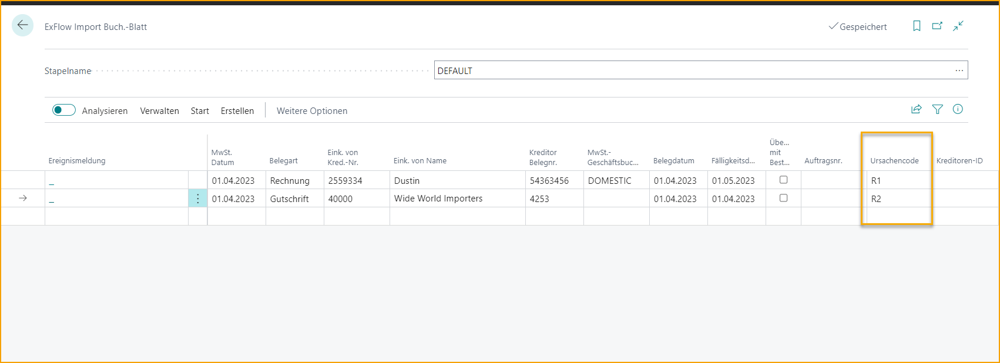

## Lokalisierung Australien

ExFlow unterstützt die australische Lokalisierung.

### Grundcode

Der Grundcode kann aus dem Importjournal ausgewählt werden, was effizient für
Gutschriften ist, bei denen der Grundcode beim Buchen im Genehmigungsstatus
obligatorisch ist.

Der Grundcode wird auf jeden Hauptbuch- und Lieferanteneintrag kopiert,
wenn das Dokument gebucht wird. Beachten Sie, dass es nur möglich ist,
einen Grundcode den Dokumentzeilen zuzuweisen, da alle Zeilen als ein
Eintrag gebucht werden.

