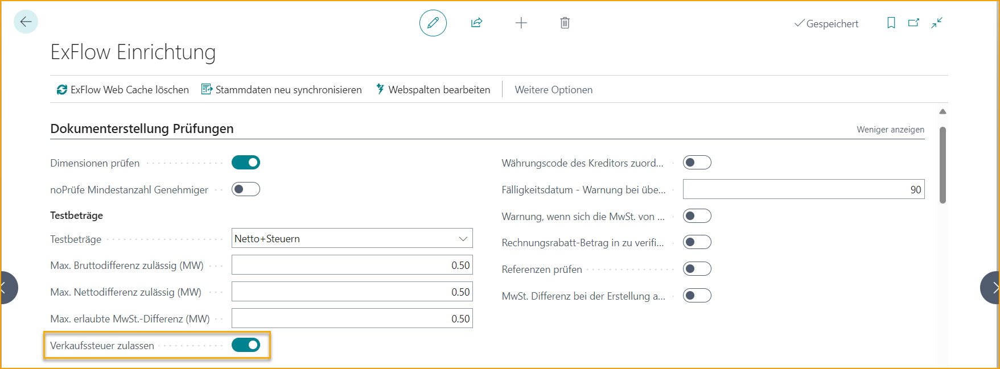
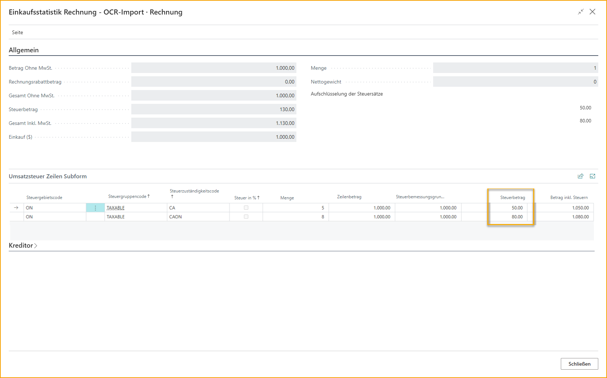
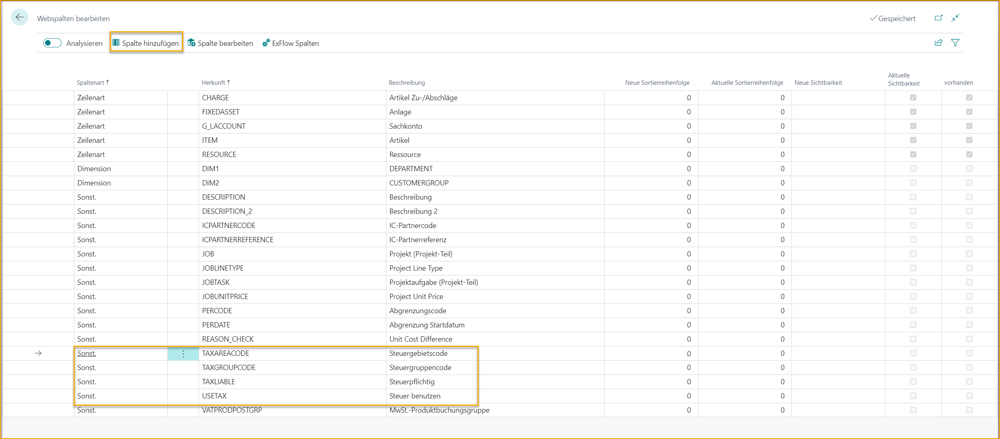

## Lokalisierung Kanada

### Sprache

ExFlow unterstützt die Sprache Französisch (Kanada) in Business Central.

### Kanadische Umsatzsteuer

Gehe zu: ***Setup \--\> ExFlow Setup \--\> Doc. Creation Checks Tab***

Aktiviere "Allow Sales Tax" in den ExFlow-Einstellungen.

Mit dieser Einstellung wird die Produktbuchungsgruppe für die Mehrwertsteuer in ExFlow nicht obligatorisch und ermöglicht die Verarbeitung der nordamerikanischen Umsatzsteuer.

Um die nordamerikanische Umsatzsteuer zu unterstützen, werden die steuerrelevanten Felder aus dem Einkaufsdokumentkopf und den Einkaufsdokumentzeilen auch im ExFlow Import Journal implementiert. Die Funktionalitäten dieser Felder sind ähnlich wie in den Einkaufsdokumenten in Business Central.

**Die zusätzlichen Felder im Dokumentenkopf**

- Steuerpflichtig

- Steuergebietscode

- Provinzieller Steuergebietscode

- Steuerbefreiungsnummer

**Und in den Dokumentzeilen**

- Steuerpflichtig

- Steuergebietscode

- Provinzieller Steuergebietscode

- GST/HST

- Steuergruppencode

- Verwendungsteuer

Mit der Verwendung der kanadischen Steuereinstellungen unterstützt das ExFlow Import Journal auch Steuerberechnungen basierend auf der kanadischen Steuer. Die Funktionalität zum Abrufen des Steuergebietscodes usw. aus den Unternehmensinformationen und dem Standort anstelle der Lieferantenkarte wird ebenfalls im ExFlow Import Journal berücksichtigt.

Die Statistikseite ist jetzt im ExFlow Import Journal verfügbar.

Es ermöglicht die manuelle Anpassung des Steuerbetrags, wenn eine Diskrepanz zwischen dem auf den Rechnungszeilen berechneten Steuerbetrag und dem auf der vom Lieferanten erhaltenen Rechnung angegebenen Steuerbetrag besteht (in diesem Fall durch den OCR-Dienst interpretiert).

### Steuergruppencode im ExFlow-Einkaufscode behandeln

Wenn der Steuergruppencode in einer Rechnungszeile von dem abweichen muss, was standardmäßig auf dem ausgewählten Stammdatensatz dieser Rechnungszeile festgelegt ist, kann dies über einen ExFlow-Einkaufscode gehandhabt werden.

Zum Beispiel, wenn der Steuergruppencode auf einer Sachkontokarte für Büromaterial standardmäßig auf NICHT STEUERBAR gesetzt ist, während eine Zeile in einer Einkaufsrechnung mit diesem Sachkonto als STEUERBAR markiert werden muss, könnten Benutzer dies einfach in den ExFlow-Einkaufscodelinien gemäß dem untenstehenden Bild hinzufügen.

Dies würde es den Benutzern ermöglichen, die Rechnungserstellung in diesen spezifischen Szenarien zu automatisieren.

### Steuerkolonnen im Web

Es ist möglich, steuerbezogene Felder in ExFlow Web sichtbar zu machen, indem die Spalten in den ExFlow-Einstellungen hinzugefügt werden.

Lesen Sie mehr darüber, wie Sie Webspalten bearbeiten können, im Abschnitt [***ExFlow Web.***](https://docs.exflow.cloud/business-central/docs/user-manual/technical/exflow-web#exflow-web)
