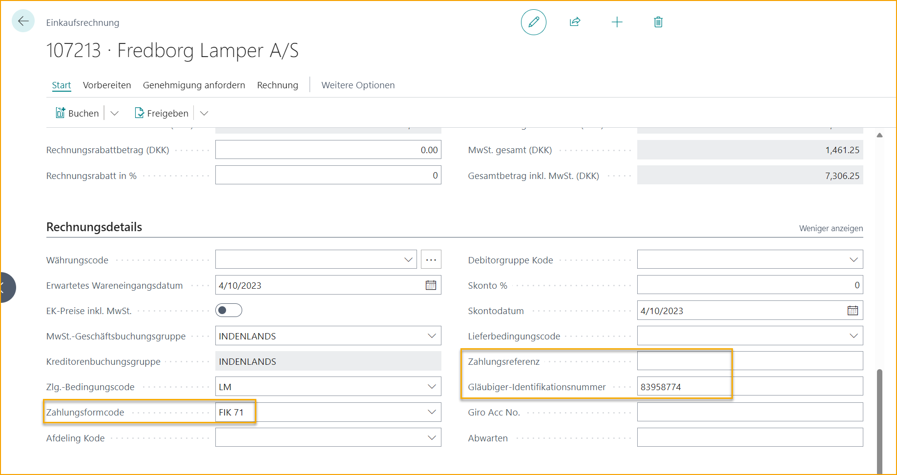

## Lokalisierung Dänemark

### Sprache

ExFlow unterstützt die dänische Sprache in Business Central.

### Zahlungsreferenz - FIK-Code

#### Hintergrund

Dänische Rechnungen enthalten eine Zahlungsreferenz, die als FIK-Code bezeichnet wird. Diese sollte auf der Rechnung erfasst und beim Erstellen der Rechnung aus dem Importjournal das Feld "Zahlungsreferenz" im Einkaufsrechnungsheader ausfüllen.

Das Format der interpretierten Zahlungsreferenz auf der Rechnung muss beim Import in ExFlow transformiert werden, um das korrekte Format zu erhalten.

Beispiel:

Eingabe: +71\<**125396534461985**+83958774\<

Ausgabe: **125396534461985**

#### Lösung

##### Transformation

Transformation implementiert unter Verwendung der Funktionalität "Datenaustauschdefinition". Die Konfiguration wird durch eine Transformationsregel ergänzt, die unnötige Zeichen entfernt.

##### Ausfüllen des Einkaufsrechnungsheaders

Die transformierte Zahlungsreferenz wird im Importjournal in "Lieferantenbeleg-Nr. 2" importiert.

Beim Erstellen der Rechnung wird das Feld "Zahlungsreferenz" im Einkaufsrechnungsheader mit der transformierten Zahlungsreferenz aus "Lieferantenbeleg-Nr. 2" ausgefüllt.
