## Power BI

Es gibt vorbereitete Einstellungen und Vorlagen zur Analyse von ExFlow-Daten mit Power BI. 

Power BI-Vorlagen (BCO/BC OnPrem) können von Partnern im [***Partner-Portal***](https://partners.signupsoftware.com/px/digital-asset-management/admin/media-library?collectionId=110867&renderMode=Collection) gefunden werden.

Lesen Sie mehr über [Power BI-Integration aktivieren](https://learn.microsoft.com/de-de/dynamics365/business-central/admin-powerbi-setup#setup) und [Arbeiten mit Power BI-Berichten in Business Central](https://learn.microsoft.com/de-de/dynamics365/business-central/across-working-with-powerbi), bevor Sie mit der Installation beginnen.

### Voraussetzungen
Dynamics 365 Business Central-Konto mit einer Power BI-Lizenz. 

Für die Einrichtung der Integration muss Power BI Desktop heruntergeladen und installiert werden.

Diese Anleitung funktioniert sowohl für Business Central Online (SaaS) als auch für OnPrem. Die Einrichtungsverfahren unterscheiden sich leicht, lesen Sie weiter unten mehr darüber.

## Installation
Beginnen Sie mit: **ExFlow-Einrichtung --> Aktionen --> Funktionen --> Power BI** 

|Power BI||
|:-|:-|	
|Power BI-Webdienste erstellen| Alle benötigten Webdienste in einem Unternehmen veröffentlichen
|Power BI-Webdienste löschen|Bestehende Power BI-Webdienste löschen
|BC-Datenquelle abrufen|URL-Zeichenfolge wird bereitgestellt, um sie in Power BI Desktop zu kopieren (OnPrem)
|Power BI-Vorlage abrufen|Link zum Herunterladen der Power BI-Vorlagendatei aus dem Partner-Portal

### ExFlow für Power BI einrichten

In der ExFlow-Einrichtung erstellen Sie die ExFlow-Webdienste, indem Sie *Aktionen --> Funktionen --> Power BI --> Power BI-Webdienste erstellen* drücken

Es wird eine Bestätigungsmeldung angezeigt: ''ExFlow Power BI-Webdienste wurden erstellt''.

### Importieren der Power BI-Vorlage in Power BI Desktop
Öffnen Sie Power BI Desktop und melden Sie sich mit Ihrem Konto an. Power BI Desktop ist eine kostenlose Microsoft-Anwendung, die Sie auf Ihrem lokalen Computer installieren.  

Laden Sie die neueste vorbereitete Power BI-Vorlage für ExFlow herunter. 

Partner mit Zugriff auf die SignUp-Partnerseite können sie [hier](https://azuresignup.sharepoint.com/sites/Signupsoftware/SitePages/BC-POWER-BI.aspx) herunterladen. Wenn Sie keinen Zugriff auf das Partnerportal haben, wenden Sie sich an den SignUp-Support, um die Informationen zu erhalten. Die Datei sollte einen ''.pbit'' -Dateityp haben.  

Sie können auch von ExFlow-Einstellungen herunterladen, indem Sie drücken: *Aktionen --> Funktionen --> Power BI --> Power BI-Vorlage abrufen*

Importieren Sie die vorbereitete Power BI-Vorlage für ExFlow, indem Sie *Datei --> Importieren --> Power BI-Vorlage* wählen. 

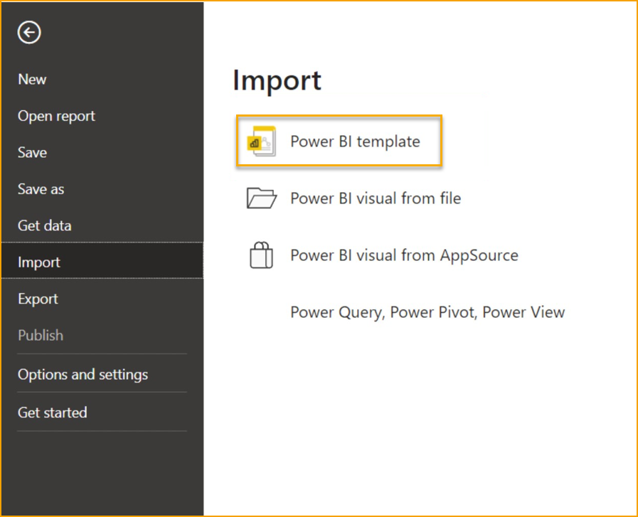

Wählen Sie die Vorlage aus, die Sie gerade heruntergeladen haben. Sie werden nun nach der zu verwendenden BCDataSource gefragt. 

Für BC OnPrem erhalten Sie den Link aus den ExFlow-Einstellungen, indem Sie *Aktionen --> Funktionen --> Power BI --> BC-Datenquelle abrufen* drücken.  

Für Business Central Online bezieht sich die Datenquelle auf die spezifische BC-Umgebung (Datenbank), mit der Sie eine Verbindung herstellen möchten. 

Wählen Sie die BC-Datenbank aus der Dropdown-Liste aus:

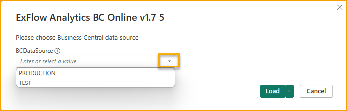

In einer Multi-Umgebung sehen Sie die Datenbank am Ende der Verbindungszeichenfolge zu Ihrer Umgebung. 

Wenn Sie Ihre Unternehmen nicht abrufen können, besteht der erste Schritt, um die Verbindung zu BC Online zu testen, darin, *Daten abrufen --> Weitere --> Dynamics 365 Business Central* zu drücken und dann auf Verbinden zu klicken. 

Wenn die Verbindung wie erwartet funktioniert, sollten Ihre Datenbanken hier sichtbar sein. 

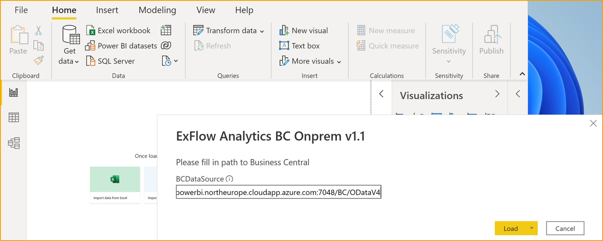

Nachdem Sie die richtige BCDatasource eingegeben haben, drücken Sie Laden.  

Der obige Screenshot gilt für OnPrem, aber mit der Online-Vorlage ist der Schritt ähnlich.  
     
Wenn die Verbindung zu Ihrer Business Central-Umgebung wie erwartet funktioniert, sollten Sie in der Lage sein, Ihre Unternehmen im oberen linken Diagramm zu sehen: 

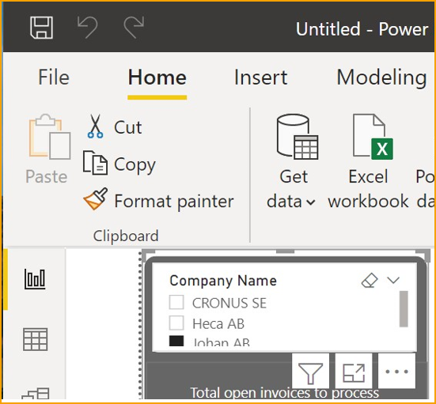

Wenn Sie Ihre Unternehmen nicht abrufen können, liegt wahrscheinlich ein Fehler bei der Verbindung zu BC vor. 

Speichern Sie das Berichtspaket, indem Sie auf Datei --> Speichern klicken. 

Geben Sie ihm einen Namen, der auch in BC beschreibend ist.  

### Veröffentlichen in einem Arbeitsbereich in Power BI 

Um das gerade erstellte ExFlow Power BI-Berichtspaket in die Power BI-Registerkarte in BC zu veröffentlichen, beginnen Sie damit, es im entsprechenden Power BI-Arbeitsbereich zu veröffentlichen. 

Klicken Sie auf *Veröffentlichen (oben im Desktop-Menü) --> Mein Arbeitsbereich --> Auswählen*

Wenn die Veröffentlichung erfolgreich ist, sollten Sie eine Erfolgsmeldung erhalten.  

### Power BI öffnen und konfigurieren
Der nächste Schritt besteht darin, sich mit Ihrem Konto bei [Power BI](https://www.powerbi.com) anzumelden. 

Unter einem der Arbeitsbereiche sollten Sie den gerade veröffentlichten Bericht finden. 

Von hier aus können Sie auch zusätzliche Einstellungen für das Berichtspaket ändern, z. B. die geplante Aktualisierungsrate festlegen. 

Wenn Sie einen Power BI-Bericht in einen Arbeitsbereich veröffentlicht haben, ist er auch von innerhalb von BC für Benutzer mit Zugriff auf diesen Arbeitsbereich verfügbar. 

Diese Verbindung wird weiter unten näher beschrieben.  

### Power BI in Business Central einbetten 

#### Einbetten in Power BC Online 

Im ExFlow Accountant-Rollencenter gibt es einen Bereich für Power BI-Berichte: 

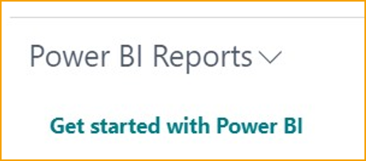

Von Anfang an ist dies leer, und Sie müssen sich mit Ihrem Power BI-Konto verbinden. 

1.	Drücken Sie „Erste Schritte mit Power BI“ 
2.	Klicken Sie im Assistenten zur Einrichtung auf Weiter 
3.	Im nächsten Schritt wird die Power BI-Lizenz überprüft, drücken Sie erneut Weiter.  
4.	Schließen Sie die Einrichtung mit Weiter und Fertig ab.  

Es kann einige Minuten dauern, bis die Power BI-Lizenz überprüft wurde. 

Sobald die Lizenz überprüft wurde, können Sie mit dem letzten Schritt in diesem Handbuch fortfahren.

#### Einbetten in Power BC OnPrem 

Für Business Central On-Premises müssen einige Dinge eingerichtet werden: 

1.	Konfigurieren Sie entweder die NavUserPassword- oder die Azure Active Directory-Authentifizierung, die Power BI-Integration unterstützt keine Windows-Authentifizierung.  
2.	ODATA-Webdienste und ODATAv4-Endpunkt aktivieren.  
3.	Eine Anwendungsregistrierung für Business Central in Azure erstellen. Dies ist erforderlich, um Business Central On-Premises mit dem Power BI-Dienst zu verbinden. 
Siehe [Microsofts Anleitung zur Registrierung von Business Central in Azure AD](https://learn.microsoft.com/en-us/dynamics365/business-central/dev-itpro/administration/register-app-azure)  
4.	In Business Central gehen Sie zu „Assistierte Einrichtung“ und starten „Richten Sie Ihre Azure Active Directory-Konten ein“ und gehen Sie die Schritte durch.  

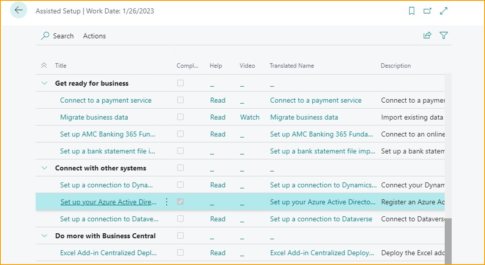

a.	Es wird ein Informationstext angezeigt  
b.	Füllen Sie „Antwort-URL“, „Anwendungs-ID“ und „Schlüssel“ aus der Anwendungsregistrierung in Azure AD aus (siehe Link in Schritt 3 oben)  
c.	Klicken Sie auf Weiter und Fertig stellen  
5.	In Business Central klicken Sie auf „Erste Schritte mit Power BI“, um den Prozess zu starten, und folgen Sie den Schritten 1-4 im Abschnitt „BC Online“. Der Unterschied für BC On-Premises besteht darin, dass ein Administrator nach dem letzten Schritt der Power BI-Dienstautorisierung zustimmen muss.  
a.	Drücken Sie „Erste Schritte mit Power BI“ 
b.	Im Assistenten zur Einrichtung auf Weiter klicken 
c.	Erneut auf Weiter klicken 
d.	Azure-Dienste autorisieren  

Wenn die Autorisierung abgeschlossen ist, können Sie mit dem letzten Schritt fortfahren.

### Überprüfen Sie den Power BI-Bericht und aktivieren Sie ihn in BC	 

Wenn der Bericht in einem Arbeitsbereich veröffentlicht wurde, sollten Sie ihn unter Ihren Power BI-Berichten in BC sehen können. 

Um ihn zu aktivieren und auszuwählen, klicken Sie auf: *Power BI-Berichte --> Bericht auswählen*
 
Wenn der Bericht nicht aktiviert ist, klicken Sie auf *Weitere Optionen anzeigen --> Aktivieren* 

Nachdem Sie auf OK geklickt haben, sollte der Power BI-Bericht für Sie unter *Insights* in BC sichtbar sein. 

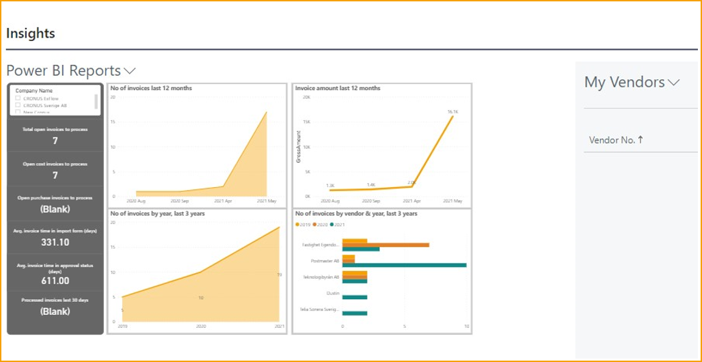

### Fehlerbehebung – Abfragen

Wenn Sie beim Aktualisieren von Abfragen in Power BI auf einen Fehler im Zusammenhang mit der Datenschutzeinstellung stoßen, befolgen Sie diese Schritte, um ihn zu beheben:

Navigieren Sie zu: *Datei --> Optionen und Einstellungen --> Optionen** 

Wählen Sie im Abschnitt Aktuelle Datei die Datenschutzoption aus.

Aktivieren Sie das Kontrollkästchen: *"Datenschutzeinstellungen ignorieren und möglicherweise die Leistung verbessern"* 

Klicken Sie auf OK, kehren Sie zu Ihrem Bericht zurück und wählen Sie Aktualisieren.

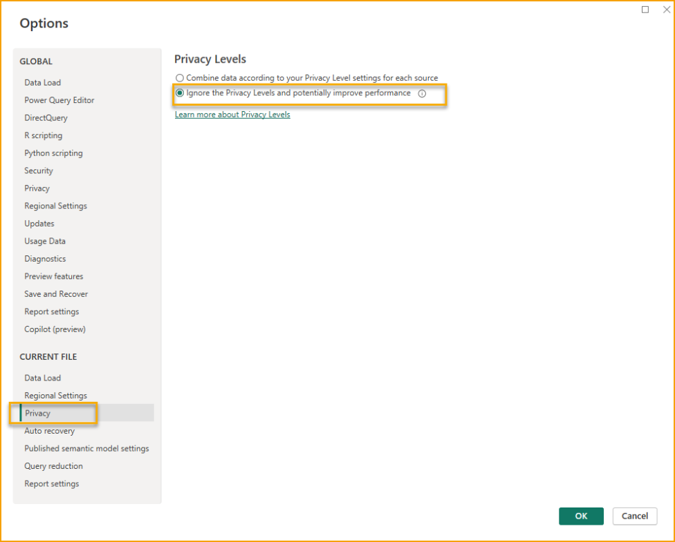

Diese Anpassung umgeht die Durchsetzung der Datenisolierung zwischen den Quellen und kann Probleme bei der Abfrageausführung im Zusammenhang mit nicht übereinstimmenden Datenschutzeinstellungen lösen.

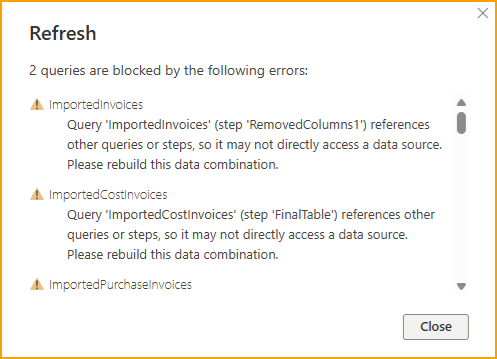

## Zugriff auf gebuchte Dokumente in Business Central von Power BI Desktop

Ab ExFlow-Version 21.1 ist es möglich, in Power BI Links zu
gebuchten Einkaufsdokumenten zu erstellen. 

Es ist erforderlich, Zugriff auf die spezifische
Seite in Business Central zu haben, um das Dokument sehen zu können. 

Um diese
Funktionalität zu nutzen, stellen Sie sicher, dass die neuesten ExFlow Power BI-Webdienste
verwendet werden, indem Sie sie löschen und erneut erstellen. 

In der neuesten ExFlow
Power BI-Vorlagendatei gibt es einen vorbereiteten Bericht namens Gebuchte
Dokumente.

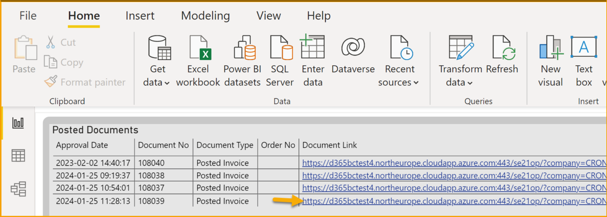

Klicken Sie auf den Dokumentenlink, um zur Buchungsdokumentenkarte in ExFlow
Genehmigungsstatusverlauf zu gelangen.

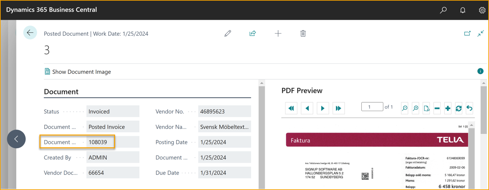

