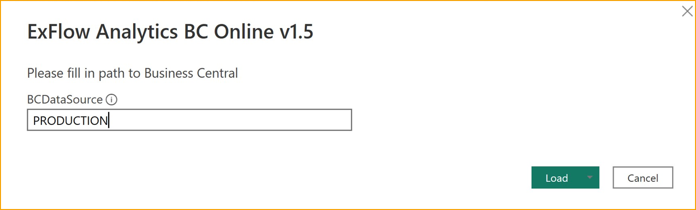

## Power BI

Es gibt vorbereitete Einstellungen und Vorlagen zur Analyse von ExFlow-Daten mit Power BI. 

Power BI-Vorlagen (BCO/BC OnPrem) können von Partnern im [***Partner-Portal***](https://azuresignup.sharepoint.com/sites/Signupsoftware/SitePages/BC-POWER-BI.aspx?xsdata=MDV8MDJ8fDU2YzBmOTZlYjUxZjRmMjg0MzNmMDhkYzg0NmE3MmIwfDg3NzkxMTdkNzcyZTRlYTU5NGVjNDRhMWExZDA0MjdifDB8MHw2Mzg1MzA4Mzk5MDUzMjE3OTF8VW5rbm93bnxWR1ZoYlhOVFpXTjFjbWwwZVZObGNuWnBZMlY4ZXlKV0lqb2lNQzR3TGpBd01EQWlMQ0pRSWpvaVYybHVNeklpTENKQlRpSTZJazkwYUdWeUlpd2lWMVFpT2pFeGZRPT18MXxMMk5vWVhSekx6RTVPbUZpTVRJNU1EWXlNVEExWlRSaFkyTTVaR05pWVRBNE1EUTFNR1JpTkRSbVFIUm9jbVZoWkM1Mk1pOXRaWE56WVdkbGN5OHhOekUzTkRnM01UZzVPRFExfDY3MTk3NmJkNzFmZTQ4YmQ0MzNmMDhkYzg0NmE3MmIwfDIyZmJkZjM2ZjZhNTRjNjE5MzIxYWNkOTY5YTFmYThl&sdata=UkdFQTF4T2Vra3R2Vk5sMUYxTXpWbkdZcXE4OEUxZ3h1WEZhcUhlN0NpMD0%3D&ovuser=8779117d-772e-4ea5-94ec-44a1a1d0427b%2Csofia.nikolic%40signupsoftware.com&OR=Teams-HL&CT=1717489911732&clickparams=eyJBcHBOYW1lIjoiVGVhbXMtRGVza3RvcCIsIkFwcFZlcnNpb24iOiI0OS8yNDA1MDMwNzYxNCIsIkhhc0ZlZGVyYXRlZFVzZXIiOmZhbHNlfQ%3D%3D) gefunden werden.

Lesen Sie mehr über [Power BI-Integration aktivieren](https://learn.microsoft.com/de-de/dynamics365/business-central/admin-powerbi-setup#setup) und [Arbeiten mit Power BI-Berichten in Business Central](https://learn.microsoft.com/de-de/dynamics365/business-central/across-working-with-powerbi), bevor Sie mit der Installation beginnen.

### Voraussetzungen
Dynamics 365 Business Central-Konto mit einer Power BI-Lizenz. 

Zur Einrichtung der Integration muss Power BI Desktop heruntergeladen und installiert werden.

Diese Anleitung funktioniert sowohl für Business Central Online (SaaS) als auch für OnPrem. Die Einrichtungsverfahren unterscheiden sich leicht, lesen Sie weiter unten mehr darüber.

## Installation
Beginnen Sie mit: **ExFlow-Einrichtung --> Aktionen --> Funktionen --> Power BI** 

|Power BI||
|:-|:-|	
|Power BI-Webdienste erstellen| Alle benötigten Webdienste in einem Unternehmen veröffentlichen
|Power BI-Webdienste löschen|Bestehende Power BI-Webdienste löschen
|BC-Datenquelle abrufen|URL-Zeichenfolge wird bereitgestellt, um sie in Power BI Desktop zu kopieren (OnPrem)
|Power BI-Vorlage abrufen|Link zum Herunterladen der Power BI-Vorlagendatei aus dem Partner-Portal

### ExFlow für Power BI einrichten

Richten Sie in der ExFlow-Einrichtung die ExFlow-Webdienste ein, indem Sie *Aktionen --> Funktionen --> Power BI --> Power BI-Webdienste erstellen* drücken

Es wird eine Bestätigungsnachricht angezeigt, dass: ''ExFlow Power BI-Webdienste wurden erstellt''.

### Die Power BI-Vorlage in Power BI Desktop importieren
Öffnen Sie Power BI Desktop und melden Sie sich mit Ihrem Konto an. Power BI Desktop ist eine kostenlose Microsoft-Anwendung, die Sie auf Ihrem lokalen Computer installieren.

Laden Sie die neueste vorbereitete Power BI-Vorlage für ExFlow herunter. Bitte beachten Sie, dass die Vorlage entweder für BC-Online oder BC-OnPrem geeignet ist.

Partner mit Zugang zur SignUp-Partnerseite können sie [hier](https://azuresignup.sharepoint.com/sites/Signupsoftware/SitePages/BC-POWER-BI.aspx) herunterladen

Sie können auch von ExFlow-Setups herunterladen, indem Sie *Aktionen --> Funktionen --> Power BI --> Power BI-Vorlage abrufen* drücken

Wenn Sie keinen Zugriff auf die Partnerseite haben, wenden Sie sich an den SignUp-Support, um sie zu erhalten. Die Datei sollte einen ''.pbit'' -Dateityp haben.  

Importieren Sie die vorbereitete Power BI-Vorlage von ExFlow, indem Sie *Datei --> Importieren --> Power BI-Vorlage* wählen. 

Wählen Sie die Vorlage aus, die Sie gerade heruntergeladen haben. Sie werden nun nach der zu verwendenden BCDataSource gefragt. 

Für BC OnPrem erhalten Sie den Link von ExFlow-Setups, indem Sie *Aktionen --> Funktionen --> Power BI --> BC-Datenquelle abrufen* drücken  

Für BC Online ist die Datenquelle in diesem Fall die BC-Datenbank, mit der Sie sich verbinden möchten, in Großbuchstaben.  

In einer Multi-Umgebung sehen Sie die Datenbank am Ende der Verbindungszeichenfolge zu Ihrer Umgebung. 

Wenn Sie Ihre Unternehmen nicht abrufen, besteht der erste Schritt, um die Verbindung zu BC Online zu testen, darin, *Daten abrufen --> Weitere --> Dynamics 365 Business Central* zu drücken und dann auf Verbinden zu klicken. 

Wenn die Verbindung wie erwartet funktioniert, sollten Ihre Datenbanken hier sichtbar sein. 

Nachdem Sie die richtige BCDatasource eingegeben haben, drücken Sie auf Laden.  

Der obige Screenshot ist für OnPrem, aber mit der Online-Vorlage ist der Schritt ähnlich.  
     
Wenn die Verbindung zu Ihrer Business Central-Umgebung wie erwartet funktioniert, sollten Sie in der Lage sein, Ihre Unternehmen im oberen linken Diagramm zu sehen: 

Wenn Sie Ihre Unternehmen nicht abrufen, liegt wahrscheinlich ein Fehler bei der Verbindung zu BC vor. 

Speichern Sie das Berichtspaket, indem Sie auf Datei --> Speichern klicken. 

Geben Sie ihm einen Namen, der auch in BC beschreibend sein wird.  

### In einen Arbeitsbereich in Power BI veröffentlichen 

Um das gerade erstellte ExFlow Power BI-Berichtspaket in die Power BI-Registerkarte in BC zu veröffentlichen, müssen Sie es zunächst in den entsprechenden Power BI-Arbeitsbereich veröffentlichen. 

Klicken Sie auf *Veröffentlichen (oben im Desktop-Menü) --> Mein Arbeitsbereich --> Auswählen*

Wenn die Veröffentlichung erfolgreich ist, sollten Sie eine Erfolgsnachricht erhalten.  

### Power BI öffnen und konfigurieren
Der nächste Schritt besteht darin, sich mit Ihrem Konto bei [Power BI](https://www.powerbi.com) anzumelden. 

Unter einem der Arbeitsbereiche sollten Sie den gerade veröffentlichten Bericht finden. 

Von hier aus können Sie auch zusätzliche Einstellungen für das Berichtspaket ändern, z. B. die geplante Aktualisierungsrate festlegen. 

Wenn Sie einen Power BI-Bericht in einen Arbeitsbereich veröffentlicht haben, ist er auch von innerhalb von BC für Benutzer mit Zugriff auf diesen Arbeitsbereich verfügbar. 

Diese Verbindung wird weiter unten beschrieben.  

### Power BI in Business Central einbetten 

#### In Power BC Online einbetten 

Im ExFlow Accountant-Rollen-Center gibt es einen Power BI-Berichtsteil: 

Von Anfang an ist dies leer, und Sie müssen sich mit Ihrem Power BI-Konto verbinden. 

1.	Drücken Sie „Erste Schritte mit Power BI“ 
2.	Klicken Sie im Assistenten zur Einrichtung auf Weiter 
3.	Im nächsten Schritt wird die Power BI-Lizenz überprüft, drücken Sie Weiter.  
4.	Schließen Sie die Einrichtung mit Weiter und Fertigstellen ab.  

Es kann einige Minuten dauern, bis die Power BI-Lizenz überprüft wurde. 

Wenn die Lizenz überprüft wurde, können Sie mit dem letzten Schritt in diesem Handbuch fortfahren.

#### In Power BC OnPrem einbetten 

Für Business Central On-Premises müssen einige Dinge eingerichtet werden: 

1.	Konfigurieren Sie entweder die NavUserPassword- oder die Azure Active Directory-Authentifizierung, die Power BI-Integration unterstützt keine Windows-Authentifizierung.  
2.	ODATA-Webdienste und ODATAv4-Endpunkt aktivieren.  
3.	Eine Anwendungsregistrierung für Business Central in Azure erstellen. Dies ist erforderlich, um Business Central On-Premises mit dem Power BI-Dienst zu verbinden. 
Siehe [Microsofts Anleitung zur Registrierung von Business Central in Azure AD](https://learn.microsoft.com/en-us/dynamics365/business-central/dev-itpro/administration/register-app-azure)  
4.	In Business Central gehen Sie zu „Assisted Setup“ und starten „Richten Sie Ihre Azure Active Directory-Konten ein“ und gehen Sie die Schritte durch.  

a.	Es wird ein Informationstext angezeigt  
b.	Füllen Sie „Antwort-URL“, „Anwendungs-ID“ und „Schlüssel“ aus der Anwendungsregistrierung in Azure AD aus (siehe Link in Schritt 3 oben)  
c.	Klicken Sie auf Weiter und Fertigstellen  
5.	In Business Central klicken Sie auf „Erste Schritte mit Power BI“, um den Prozess zu starten, und folgen Sie den Schritten 1-4 im Abschnitt „BC Online“. Der Unterschied bei BC On-Premises besteht darin, dass ein Administrator nach dem letzten Schritt der Power BI-Dienstautorisierung zustimmen muss.  
a.	Drücken Sie „Erste Schritte mit Power BI“ 
b.	Klicken Sie im Assistenten zur Einrichtung auf Weiter 
c.	Klicken Sie erneut auf Weiter 
d.	Azure-Dienste autorisieren  

Wenn die Autorisierung abgeschlossen ist, können Sie mit dem letzten Schritt fortfahren.

### Den Power BI-Bericht überprüfen und in BC aktivieren	 

Wenn der Bericht in einen Arbeitsbereich veröffentlicht wurde, sollten Sie ihn unter Ihren Power BI-Berichten in BC sehen können. 

Um ihn zu aktivieren und auszuwählen, klicken Sie auf: *Power BI-Berichte --> Bericht auswählen*
 
Wenn der Bericht nicht aktiviert ist, klicken Sie auf *Weitere Optionen anzeigen --> Aktivieren* 

Nachdem Sie auf OK geklickt haben, sollte der Power BI-Bericht für Sie unter *Insights* in BC sichtbar sein. 

## Auf veröffentlichte Dokumente in Business Central von Power BI Desktop aus zugreifen

Ab ExFlow-Version 21.1 ist es möglich, in Power BI Links zu erstellen
veröffentlichte Einkaufsdokumente. 

Es ist erforderlich, Zugriff auf die spezifische
Seite in Business Central zu haben, um das Dokument sehen zu können. 

Um diese
Funktionalität zu nutzen, stellen Sie sicher, dass die neuesten ExFlow Power BI-Webdienste
werden verwendet, indem Sie sie löschen und erneut erstellen. 

In der neuesten ExFlow
Power BI-Vorlagendatei gibt es einen vorbereiteten Bericht namens Posted
Documents.

Klicken Sie auf den Dokumentenlink, um zur Karte des veröffentlichten Dokuments in ExFlow
Genehmigungsstatusverlauf.

