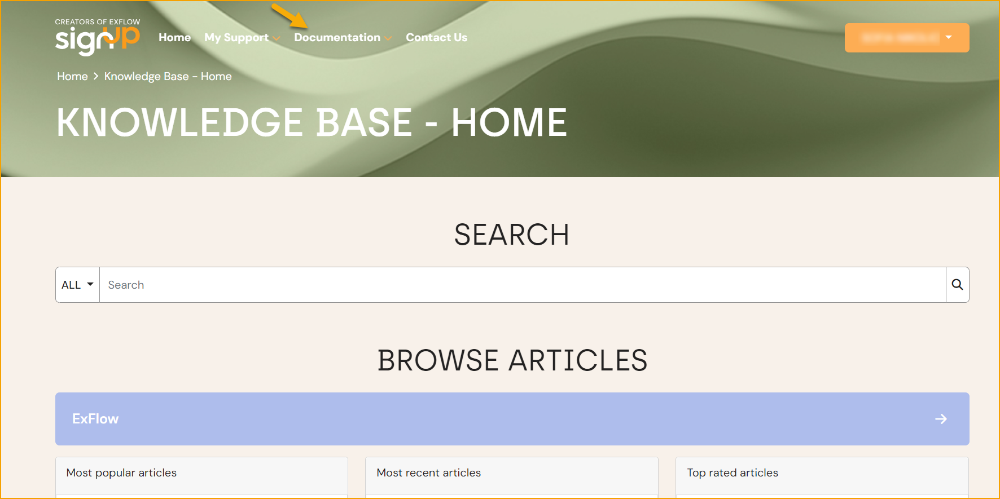

## Häufig gestellte Fragen

Melden Sie sich im Support-Portal an und gehen Sie zur Dokumentation, um alle Wissensdatenbankartikel zu durchsuchen, die auf häufig gestellten Fragen basieren.

Lesen Sie mehr im Abschnitt **Support-Portal**, um herauszufinden, wie Sie sich anmelden, ein Ticket erstellen und einen Support-Portal-Ersatz hinzufügen.

### Weitere häufig gestellte Fragen:

* Wo finde ich XML- und PDF-Dateien in BC? 
Standardmäßig werden XML- und PDF-Dateien im Blob-Format in Tabelle 133 gespeichert.

* Was kann ich tun, um die schlechte Auflösung von PDF-Bildern in Business Central und ExFlow Web zu verbessern? 
Ein Tipp dazu finden Sie hier: [PDF-Darstellungsprobleme in Google Chrome unter Windows 10](https://support.papersapp.com/support/solutions/articles/30000046026-pdf-rendering-issues-in-google-chrome-on-windows-10)

* Wie ändere ich die Umsatzsteuer-Buchungsgruppe in den Importjournalzeilen? 
Verwenden Sie "Personalisieren", um das Feld zu den Zeilen hinzuzufügen.
